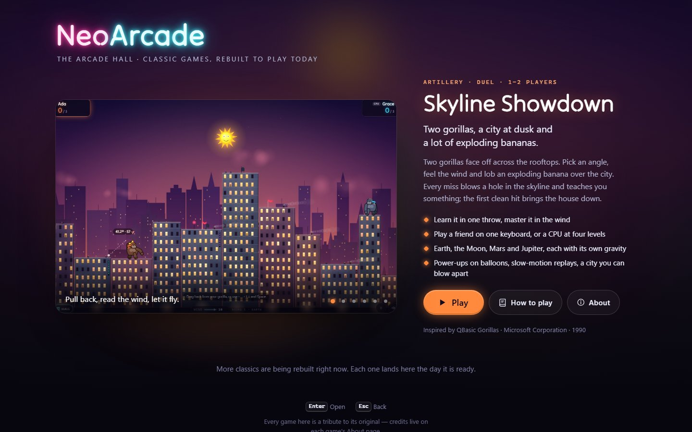

# NeoArcade

Classic games from the BASIC, Pascal, C and Assembler era, reborn as modern
web games — and gathered in one place: the **Arcade Hall**.

Every port keeps the soul of the original (rules, feel, surprises) and gets a
brand-new look. Graphics are drawn by code (Canvas / SVG / WebGL), not by
copying old sprites.



## Run it

Needs Node.js 20 or newer.

```sh
npm install
npm run dev        # the Hall at http://localhost:5173/hall/ (/ redirects there)
```

| Command | What it does |
|---|---|
| `npm run dev` | Dev server for the Hall and every port. Games are at `/ports/<slug>/`. |
| `npm run build` | Type-checks, then builds a static site into `dist/` (Hall at `dist/index.html`, each game in `dist/<slug>/`). |
| `npm run preview` | Serves `dist/` at http://localhost:4173/. |
| `npm test` | Unit tests (Vitest). |
| `npm run test:e2e` | Builds, then runs Playwright smoke tests on desktop and phone profiles. |
| `npm run screenshots` | Playwright screenshots of the Hall into `hall/media/`. |
| `npm run docs:check` | Renders every Mermaid diagram in the docs to prove it works. |
| `npm run lint` | ESLint and Prettier checks (`npm run format` fixes formatting). |

On a fresh machine, `npx playwright install chromium` fetches the browser the
e2e tests and the Mermaid check use.

`dist/` works from any static host. Each `dist/<slug>/` folder also runs on
its own if copied elsewhere; only its "back to the Hall" button needs the Hall
next to it.

## Layout

| Folder | What lives there |
|---|---|
| `sources/` | Original source code, one folder per game. Read-only reference. |
| `ports/` | The web ports, one folder per game (`ports/<slug>/`). |
| `hall/` | The Arcade Hall — the lobby where players pick a game ([architecture](docs/HALL-ARCHITECTURE.md)). |
| `hall/covers/` | One animated, code-drawn cover per game. |
| `shared/` | Small reusable pieces: input, synthesized audio, seeded RNG, game loop, storage, post-FX, the Hall button ([index](shared/README.md)). |
| `scripts/` | Build and docs tooling. |
| `e2e/` | Playwright smoke tests and screenshot runs. |
| `prompts/` | Build prompts written by the architect, run by Claude Code. |
| `docs/adr/` | Architecture decisions ([stack](docs/adr/0001-stack.md), [catalog and covers](docs/adr/0002-hall-catalog-and-covers.md), [game screens in the Hall](docs/adr/0005-hall-shows-game-screens.md)). |
| `docs/games/` | Per-game notes: what the original does, what changed in the port. |
| `PORTS.md` | Progress tracker for every game. |

## Add a game

1. Build it in `ports/<slug>/` with an `index.html`; `npm run build` picks it
   up automatically. Import shared code as `@shared/<module>` and call
   `mountHallButton()` so players can get back to the Hall.
2. Write `ports/<slug>/docs/HOW-TO-PLAY.md`, `ABOUT.md` and `ARCHITECTURE.md`
   (see `CLAUDE.md`), with screenshots in `ports/<slug>/media/`.
3. Draw its cover in `hall/covers/<slug>.ts`:

   ```ts
   import { defineCover } from '../src/cover-api';

   export default defineCover({
     posterTime: 2,
     create({ seed, accent }) {
       return {
         draw(ctx, { width, height, time, energy }) {
           // paint a full frame; energy goes 0 → 1 while the cover has attention
         },
       };
     },
   });
   ```

4. Register it in `hall/catalog.json` with a short `pitch`, a few
   `highlights` and captioned `screens` (every field is described in
   [ADR 0002](docs/adr/0002-hall-catalog-and-covers.md)). The Hall shows the
   screenshots; the cover is the fallback.
5. Run `npm test`: a test checks that every catalog entry has its port,
   cover and docs. Then `npm run build`, `npm run test:e2e` and
   `npm run docs:check`.

## How work happens

1. A source goes into `sources/<game>/`.
2. The visual idea and UI/UX are agreed in the architect chat.
3. The architect writes a prompt into `prompts/`.
4. Claude Code reads the prompt and builds the port into `ports/<game>/`,
   then registers it in the Arcade Hall and `PORTS.md`.

## Credits

The Hall's neon lettering is [Tilt Neon](https://github.com/googlefonts/Tilt-Fonts)
by The Tilt Project Authors, used under the SIL Open Font License 1.1
(`shared/fonts/tilt-neon-OFL.txt`). Each game credits its original on its
About page.
