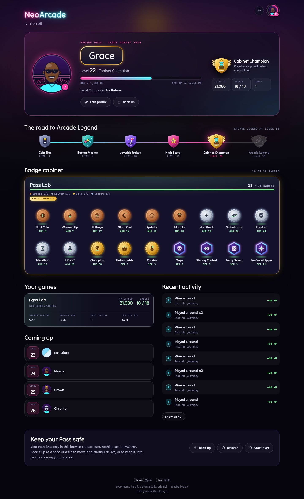
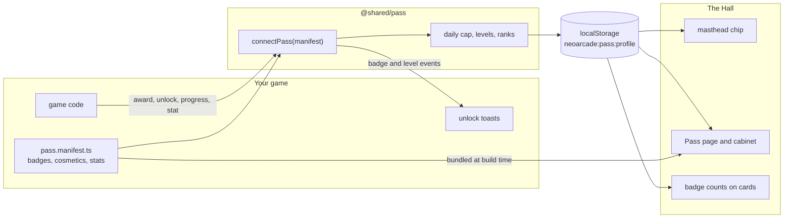
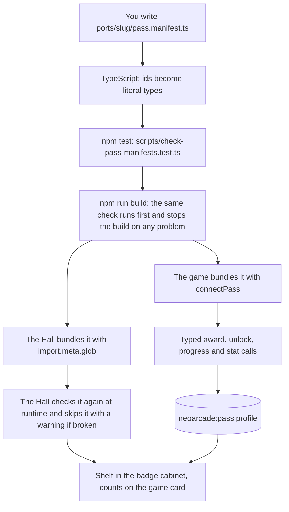

# The Arcade Pass — integration guide

The Arcade Pass is the player's profile across all of NeoArcade. Your game
tells it what the player did; the Pass turns that into XP, levels, ranks
and badges, remembers it in this browser, and the Hall shows it off: a chip
in the masthead, a Pass page with a badge cabinet, badge counts on the game
cards. This guide is everything a port needs. The reasons behind it are in
[ADR 0006](adr/0006-arcade-pass.md); the code is `shared/pass/`.



## How it fits together



The game and the Hall never talk to each other. They meet in one
localStorage document, so the Pass works offline, needs no server, and the
Hall can show badges for games the player has not opened yet (their
manifests are bundled into the Hall).

## 1. Declare what your game offers

Create `ports/<slug>/pass.manifest.ts`. It may import only from
`@shared/pass/manifest`: the build loads it in Node to check it, and the
Hall bundles it, so it must not pull in game code or touch the DOM.

```ts
import { definePassManifest, glyphs } from '@shared/pass/manifest';

export default definePassManifest({
  game: 'skyline-showdown', // your folder name
  badges: [
    {
      id: 'first-banana',
      name: 'First Banana',
      description: 'Won your first round. The city will never be the same.',
      hint: 'Win a round.',
      tier: 'bronze',
      emblem: glyphs.trophy,
    },
    {
      id: 'sunburn',
      name: 'Sunburn',
      description: 'Hit the sun ten times. It has stopped smiling.',
      hint: 'Hit the sun 10 times.',
      tier: 'silver',
      target: 10, // a counted badge
      emblem: (pen) => {
        glyphs.sun(pen);
        pen.circle(32, 32, 4, { fill: 'accent' });
      },
    },
    {
      id: 'oops',
      name: 'Oops',
      description: 'Hit yourself. Physics sends its regards.',
      tier: 'secret', // shown as ??? until earned; no hint needed
      emblem: glyphs.skull,
    },
  ],
  cosmetics: [
    { id: 'golden-banana', name: 'Golden banana', kind: 'Banana skin', unlock: { badge: 'sunburn' } },
    { id: 'party-hat', name: 'Party hat', kind: 'Headwear', unlock: { level: 5 } },
  ],
  stats: [
    { key: 'matches', label: 'Matches played' },
    { key: 'wins', label: 'Matches won' },
    { key: 'bestStreak', label: 'Best streak' },
    { key: 'longestThrow', label: 'Longest hit', unit: 'm' },
  ],
});
```

| Field | Rules |
|---|---|
| `id` | kebab-case, unique in the manifest. Never rename one that has shipped: players' badges are stored by id. |
| `name` | Up to 40 characters. |
| `description` | Shown once earned: what the player did, plus a line of flavour. Up to 160 characters. |
| `hint` | Shown while locked: how to earn it, concretely. Required except for secrets. |
| `tier` | `bronze`, `silver`, `gold` or `secret`. Each has its own medal: a coin, a rosette, a starburst, a hexagon. |
| `xp` | Optional, 0–300. Defaults: bronze 25, silver 60, gold 150, secret 80. |
| `target` | Optional, 2 or more. Makes a counted badge that unlocks when its progress gets there. |
| `emblem` | A drawing function for the pen (below) or a ready-made glyph. |

### Emblems

Emblems are drawn on a 64 × 64 grid centred on 32, 32, through a pen that
only records shapes. The Pass engraves them into the tier's medal, lights
them, and turns them into silhouettes when locked, in both themes. Colours
are roles, not values:

| Ink | Meaning |
|---|---|
| `ink` (default) | The engraving itself. |
| `shine` | Light catching an edge. |
| `accent` | A touch of enamel in your game's colour. |
| `face` | The medal's own surface, for cutting holes back out of a shape. |

```ts
emblem: (pen) =>
  pen
    .circle(32, 32, 18, { stroke: 'ink', width: 4 })
    .path('M32 14v36M14 32h36', { stroke: 'shine', width: 2 })
    .star(32, 32, 8, 3.5, 5, { fill: 'accent' }),
```

Ready-made glyphs, usable as they are or as a base: `star`, `trophy`,
`flame`, `target`, `bolt`, `heart`, `crown`, `skull`, `sun`, `moon`,
`planet`, `rocket`, `clock`, `calendar`, `medal`, `crosshair`, `burst`,
`dice`, `gamepad`, `coin`, `key`, `eye`, `wind`, `flag`, `sparkle`,
`loop`, `question`, `shield`, `hourglass`, `gem`, `check`, `mountain`.
All of them are on the Pass Lab's art sheet (below).

### Designing a good badge set

- About 20–30 badges, most of them bronze and silver, a few gold, and three
  or four secrets. A shelf should fill steadily for weeks, not in one night.
- Bronze: things that happen by playing (first win, first world visited).
  Silver: things that need skill or persistence. Gold: the milestones people
  talk about. Secret: the funny accidents and hidden tricks.
- Hints say exactly what to do ("Win on the Moon with a single throw").
  Descriptions add a smile ("The Moon has filed a complaint.").
- Counted badges suit things that pile up naturally (sun hits, craters);
  keep targets reachable in normal play.

## 2. Report what the player does

```ts
import manifest from '../pass.manifest';
import { connectPass } from '@shared/pass';

const pass = connectPass(manifest);

pass.award(40, 'Won in Jakarta');           // XP, with the line for the activity feed
pass.unlock('first-banana');                  // true the first time only
pass.progress('sunburn', { add: 1 });        // true when this reaches the target
pass.stat('matches', { add: 1 });            // or a number, { max }, { min }
pass.stat('bestStreak', { max: streak });
if (pass.isUnlocked('golden-banana')) offerSkin('golden');
if (pass.level >= 10) showVeteranTitle();    // arcade level, for your own cosmetics
```

Every id is a literal type from your manifest, so `pass.unlock('sunbrun')`
does not compile. At runtime the Pass never throws: an unknown id, a
negative award or a missing reason is ignored with one console warning, and
the game carries on.

### How much XP to award

| Moment | Suggested XP |
|---|---|
| Finishing a match or round, win or lose | 10 |
| Winning a quick match | 30–40 |
| Winning a stage or level of a campaign | 40–60 |
| A star or a clean-play bonus | 10–15 each |
| Beating a boss or rival for the first time | 100 |

Award at the moments a player would say "I did something": the end of a
match, a stage, a boss. Not per throw or per kill.

### The rules that keep it fair

- **Daily soft cap, per game.** The XP your game asks for each local day is
  granted in bands: the first 400 in full, the next 400 at half, then 10 %
  up to 2,000, then nothing. So one game can give at most 720 XP a day from
  awards. `award()` returns `{ granted, asked, reduced, level, levelUp }` if
  you want to show "+40 XP" on your results screen.
- **One award is at most 250 XP.** More is treated as a bug.
- **Badges are never capped**, and each can only be earned once.
- **Cosmetics only.** Nothing the Pass unlocks may change hitboxes, physics,
  information or difficulty. A hat is a hat.

For reference, the curve: level 2 at 150 XP (one good session), level 5 at
1,200, level 10 at 4,950, level 20 at 17,200, level 30 at 32,200, then
1,500 XP per level. Ranks: Coin Slot (1), Button Masher (5), Joystick
Jockey (10), High Scorer (15), Cabinet Champion (20), Arcade Legend (30).

## 3. Show the unlock toast

```ts
import { mountUnlockToasts } from '@shared/pass';

const toasts = mountUnlockToasts(pass, { accent: '#ff8a3d', audio });

onRoundOver(() => toasts.flush()); // the playfield can spare the attention
onTurnStart(() => toasts.hold());  // close what is showing, keep the rest queued
onBackButton(() => {
  if (toasts.visible) return toasts.dismiss(); // a pad's B closes the toast first
  openPauseMenu();
});
```

Toasts queue until you call `flush()`, so they never cover the playfield
during a turn: you decide when. Each shows the badge's medal, its name, its
description and the XP it paid, or a level-up with what it unlocked; a new
rank gets its emblem. Pass your `@shared/audio` engine and they chime
through the arcade-wide mix. Escape closes a toast before your game sees
the key; for gamepads, route your own back button through `dismiss()` as
above. Reduced motion turns every animation off.

If this browser is not saving (private mode, blocked site data, a full
quota), the toasts say so once, politely: "Progress isn't being saved".
`pass.health` tells you the same thing if you want to mention it yourself.

## 4. Show the cabinet in your game (optional)

The Hall's badge cabinet is a shared component. A game can show its own
shelf, for example on a Badges screen:

```ts
import { buildBadgeCabinet, openArcadePass } from '@shared/pass';

const cabinet = buildBadgeCabinet({
  pass: openArcadePass(),
  manifests: [manifest],
  games: [{ slug: 'skyline-showdown', title: 'Skyline Showdown', accent: '#ff8a3d' }],
});
badgesScreen.append(cabinet.element);
```

It keeps itself up to date, has one tab stop with arrow keys inside, and
opens a close-up of any badge.

## 5. Test it

- **Unit tests:** create a Pass on memory storage and a hand-driven clock:

  ```ts
  import { createArcadePass } from '@shared/pass';
  const pass = createArcadePass({ backend: null, now: () => new Date('2026-10-01T12:00'), watchOtherTabs: false });
  const game = pass.forGame(manifest);
  ```

  `backend: null` means "no storage", so nothing leaks between tests.
- **The Pass Lab.** With `npm run dev`, open
  `http://localhost:5173/hall/dev/pass-lab/`. It is a pretend game wired to
  the real Pass in your browser: award XP, unlock badges, level up, queue and
  flush toasts, load ready-made profiles (fresh, mid-season, one win from a
  level or a rank, full cabinet, Arcade Legend), pretend storage is blocked.
  `/hall/dev/pass-lab/art.html` shows every avatar part, medal, glyph and
  rank emblem. The Lab exists only on the dev server.
- **Screenshots of every Pass state:** `npx playwright test -c hall/dev`
  (see `hall/dev/pass.screens.ts`).

## The life of a manifest



What the check rejects: missing or overlong fields, ids that are not
kebab-case, duplicate ids, a `hint` missing on a non-secret badge, XP out of
range, a `target` below 2, an emblem that throws or draws nothing, a
cosmetic unlocked by a badge that does not exist, `game` not matching the
folder, and any import other than `@shared/pass/manifest`.

## What a port's ARCHITECTURE.md should say

Add a short "Arcade Pass" section: where `connectPass` is called, which
events award XP (and how much), where each badge is unlocked or counted,
which stats are kept, how cosmetics are checked, and when the game flushes
and holds toasts.

## Checklist

Copy this into your port's notes and tick it off:

```
[ ] ports/<slug>/pass.manifest.ts, importing only '@shared/pass/manifest'
[ ] game: '<slug>' matches the folder
[ ] 20–30 badges: mostly bronze and silver, a few gold, 3–4 secrets
[ ] every non-secret badge has a concrete hint; secrets have a funny description
[ ] counted badges have reachable targets
[ ] cosmetics are purely visual, unlocked by { level } or { badge }
[ ] stats declared with labels (and units where useful)
[ ] connectPass(manifest) called once at start-up
[ ] XP awarded at match/stage/boss moments, within the suggested amounts
[ ] mountUnlockToasts(pass, { accent, audio }); flush() between turns, hold() at turn start
[ ] the game's back/B action calls toasts.dismiss() while a toast is visible
[ ] nothing the Pass unlocks changes gameplay
[ ] npm test and npm run build pass (both check the manifest)
[ ] tried in the Pass Lab and in the Hall's Pass page, light and dark
[ ] ARCHITECTURE.md has an "Arcade Pass" section
```
