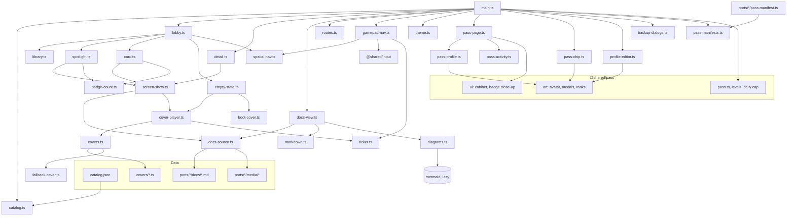
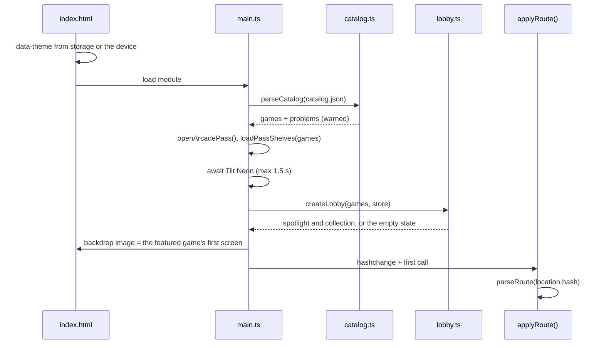
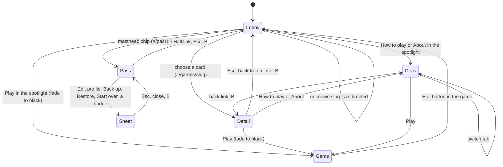
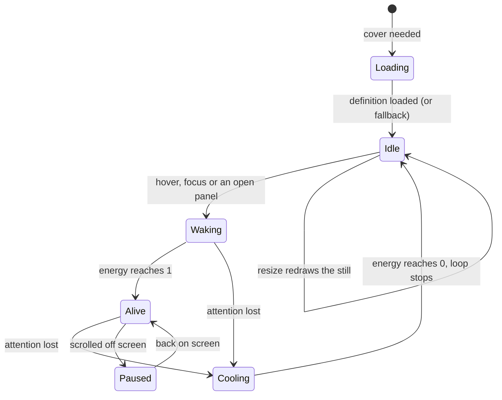
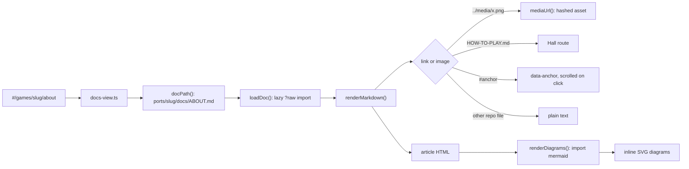

# Arcade Hall — architecture

The Hall is a single static page (`hall/index.html`) written in plain
TypeScript and DOM. It reads the catalog, puts the newest game in the
spotlight with its real screens and a few lines on why it is worth playing,
lists the rest of the collection as cards, and renders each game's player
docs. It is also home to the player's **Arcade Pass**: a chip in the
masthead and a Pass page with the profile, the rank road and the badge
cabinet. It comes in a dark and a light theme.

This document is the map; the contracts with ports are in
[ADR 0002](adr/0002-hall-catalog-and-covers.md) (catalog and covers) and
[ADR 0006](adr/0006-arcade-pass.md) (the Pass, with its integration guide in
[ARCADE-PASS.md](ARCADE-PASS.md)), the reasons for showing screenshots
rather than drawn cabinets in [ADR 0005](adr/0005-hall-shows-game-screens.md),
and the tooling in [ADR 0001](adr/0001-stack.md).

## Folder tree

```
hall/
├── index.html            page shell: theme before first paint, backdrop, masthead, <main>, footer
├── catalog.json          the list of games (schema: ADR 0002)
├── favicon.svg           code-drawn screen-and-play icon
├── covers/               one animated cover per game, <cover-id>.ts
├── media/                screenshots: with-demo/ proves a full game flow, pass/ the Arcade Pass
├── dev/                  development only, never built
│   ├── playwright.config.ts  Pass screenshots against the dev server
│   ├── pass.screens.ts   every Pass state x 3 sizes x 2 themes
│   └── pass-lab/         the Pass Lab: a pretend game, fixtures, an art sheet
├── styles/
│   ├── base.css          tokens for both themes, reset, backdrop, buttons, footer, reduced motion
│   ├── masthead.css      neon logo (glass in daylight)
│   ├── lobby.css         collection, toolbar, grid, empty and no-results states
│   ├── screens.css       a game's screens, the spotlight, the cards
│   ├── detail.css        detail dialog (centred panel, phone bottom sheet)
│   ├── docs.css          docs bar and long-form "prose" typography
│   ├── sheets.css        smaller dialogs: edit profile, backups, start over
│   └── pass.css          masthead chip, theme switch, name plates, the Pass page
└── src/
    ├── main.ts           boot: theme, Pass, catalog, lobby, docs, detail, Pass page, router, gamepad
    ├── theme.ts          light or dark: the player's choice, else the device's
    ├── pass-manifests.ts every port's Pass manifest, bundled and checked (plus the Lab's in dev)
    ├── pass-chip.ts      the player in the masthead: avatar, XP ring, level
    ├── pass-page.ts      the Pass page: composes the sections below, rebuilds on change
    ├── pass-profile.ts   profile hero (avatar, name plate, level, XP) and the rank road
    ├── pass-activity.ts  per-game stats, "Coming up" rewards, activity feed, storage notice
    ├── pass-look.ts      Hall accent theme from the Pass, name plates
    ├── profile-editor.ts edit profile: name, avatar parts, frame, Hall theme; locked parts
    ├── backup-dialogs.ts back up (code, file), restore with preview, start over
    ├── badge-count.ts    "7 / 24 badges" on cards and the spotlight
    ├── time.ts           "3 h ago" and number formatting (pure)
    ├── catalog.ts        GameEntry type, validation, formatting helpers
    ├── library.ts        genre list, search, filter and sort (pure)
    ├── routes.ts         hash routes <-> Route objects (pure)
    ├── spatial-nav.ts    "nearest box in this direction" (pure)
    ├── markdown.ts       Markdown -> HTML with repo-aware links and images
    ├── lobby.ts          spotlight, collection, toolbar, roving focus, arrow keys
    ├── spotlight.ts      the featured game: screens, pitch, highlights, Play
    ├── card.ts           one game in the collection
    ├── screen-show.ts    a game's screenshots, cross-faded with captions; cover fallback
    ├── empty-state.ts    waiting screens running their self-test
    ├── detail.ts         the detail <dialog>
    ├── docs-view.ts      the How to play / About page
    ├── docs-source.ts    bundled Markdown and screenshots from ports/
    ├── diagrams.ts       lazy Mermaid rendering in the Hall's theme
    ├── gamepad-nav.ts    gamepad-driven focus via @shared/input
    ├── launch.ts         game URLs and the fade-to-black on Play
    ├── cover-api.ts      the public cover contract (defineCover)
    ├── covers.ts         cover registry via import.meta.glob, with fallback
    ├── cover-player.ts   drives one cover on one canvas
    ├── fallback-cover.ts generic attract-mode cover
    ├── boot-cover.ts     self-test screen for the empty Hall
    ├── ticker.ts         one shared requestAnimationFrame loop
    ├── motion.ts         prefers-reduced-motion, live
    ├── colour.ts         hex helpers, readable ink on accents
    ├── dom.ts            h() element helper, icon(), isVisible()
    └── icons.ts          inline line icons
```

## Module map



## Boot and routing

`index.html` sets `data-theme` before the first paint, from
`neoarcade:hall:theme` or the device. `main.ts` validates the bundled
catalog, opens the page's Arcade Pass and its manifests, paints the Hall in
the player's accent theme, waits (at most 1.5 s) for the neon font so canvas
text is right, then builds the lobby (with badge counts), blurs the featured
game's first screen into the page backdrop, builds the docs view, the detail
dialog, the masthead chip and the Pass page, and hands control to the
router.



The URL hash is the single source of truth, so Back, reload and shared links
all work. Closing the dialog (Esc, backdrop, ×) or pressing B on a gamepad
only changes the hash; the router does the rest.



The Pass page's dialogs (edit profile, backups, start over, a badge up
close) are not routed: they are moments on the page, and closing them
returns focus to the button that opened them.

## What the Hall shows

The lobby picks the newest game (`selectGames` sorted by `added`) for the
**spotlight**: its screens large, and beside them the genres and player
count, the title, the tagline, the `pitch`, up to four `highlights`, Play,
How to play and About, and a credit line for the original. When the
catalog holds more than one game, an **All games** section follows with a
card per game; search, genre filters and sorting join it from six games
up, where they start to help. Below six games a short line says more
classics are on the way.

`screen-show.ts` turns a game's `screens` into a stack of `` frames
from the port's `media/` folder (bundled through `docs-source.ts`). In the
spotlight and the detail dialog it cross-fades every six seconds with a
slow push-in and shows each caption; dots pick a screen. Cycling pauses
while the pointer or focus is on it, stops for good once a dot is chosen,
waits while the tab is hidden and never starts with reduced motion. Cards
show only the first screen. A game without screens, or whose images all
fail to load, shows its animated cover instead.

### The Arcade Pass

The **masthead chip** shows the player's avatar inside a ring that fills
with XP towards the next level, their level on a small badge, and their
name and rank. It opens `#/pass`; an amber dot means the Pass is not being
saved.

The **Pass page** (`pass-page.ts`) stacks, from the top: a storage notice if
saving does not work; the profile hero (avatar, name plate framed by the
player's cosmetic, level, rank emblem, XP bar, what the next level unlocks,
totals); the rank road from Coin Slot to Arcade Legend, lit as far as the
player has come; the **badge cabinet** from `@shared/pass` (one lit shelf
per game, medals earned or waiting as silhouettes, secrets as ???, counted
badges with a ring, a close-up on click, "New" on badges earned since the
last visit, a gold rim on a complete shelf); per-game stats and "Coming up"
beside the activity feed; and "Keep your Pass safe" with back up, restore
and start over. Everything except the cabinet is rebuilt when the Pass
changes, including from another tab; the cabinet updates itself.

**Edit profile** previews every choice live, the Hall theme included, and
keeps nothing until Save. Locked parts stay in the list, greyed, with the
level that unlocks them. **Back up** shows the code (copy) and offers the
JSON file; **Restore** reads a pasted code or a chosen file and shows whose
Pass it is, with the one it would replace, before anything changes.

Game cards and the spotlight show "7 / 24 badges" once the game has been
played (`badge-count.ts`), and the detail panel lists it under "Your
badges". Games without a manifest show nothing.

### Covers

Covers are the fallback and the empty Hall's waiting screens. Each canvas
gets a `CoverPlayer`. It sizes the canvas to the device pixel ratio (capped
at 2), draws an idle still at `posterTime`, and animates only while the
cover has attention and is on screen. `energy` eases between 0 and 1 so
covers can "power up". All animation shares one `requestAnimationFrame`
loop in `ticker.ts` that stops when nothing needs it.



With `prefers-reduced-motion`, players never animate: energy snaps to its
target and a single frame is drawn. If `create` or `draw` throws, the player
logs once and switches to the fallback cover.

## Docs rendering



Markdown and screenshots come from two `import.meta.glob` calls in
`docs-source.ts`, so they are bundled into the Hall at build time and work
the same on the dev server and on any static host.

## Where every visual lives

| Visual | Drawn by |
|---|---|
| Backdrop: the featured screen blurred into coloured light, faded into the page | `.backdrop` in `styles/base.css`, image set in `src/main.ts` |
| Film grain | `.grain` in `styles/base.css` (inline SVG turbulence) |
| Neon logo, tube strike, flickering letter | `styles/masthead.css` |
| Game screens: frames, cross-fade, push-in, caption, dots | `src/screen-show.ts` + `styles/screens.css` |
| Spotlight: accent glow under the screen, title, pitch, highlight diamonds | `src/spotlight.ts` + `styles/screens.css` |
| Cards: frame, hover lift, accent shadow, focus ring | `src/card.ts` + `styles/screens.css` |
| Detail panel, bottom sheet, grab handle | `styles/detail.css` |
| Docs typography, tables, framed screenshots, diagram cards | `styles/docs.css`; Mermaid theme in `src/diagrams.ts` |
| Generic attract-mode cover | `src/fallback-cover.ts` |
| Empty-Hall self-test (static, colour bars, RAM test, PLEASE WAIT) | `src/boot-cover.ts` |
| Icons | `src/icons.ts` (inline SVG paths) |
| Favicon | `hall/favicon.svg` |
| Masthead chip: XP ring, level badge, warning dot | `src/pass-chip.ts` + `styles/pass.css` |
| Theme switch (sun and moon) | `buildThemeToggle` in `src/main.ts`, icons in `src/icons.ts` |
| Name plates: plain, neon, chrome, pixel, gold leaf, legend (turning prism) | `.name-plate--*` in `styles/pass.css` |
| Pass page: hero, XP bar, rank road, stats, rewards, feed, safekeeping | `src/pass-*.ts` + `styles/pass.css` |
| Avatars (every part), badge medals and glyphs, rank emblems | `@shared/pass/art/*` (see [ARCADE-PASS.md](ARCADE-PASS.md)) |
| Badge cabinet and close-up, unlock toasts | `@shared/pass/ui/*` |
| Edit profile, backups, start over | `src/profile-editor.ts`, `src/backup-dialogs.ts` + `styles/sheets.css` |

Palette tokens live at the top of `styles/base.css` (`--magenta`, `--cyan`,
`--violet`, `--amber`, ink levels, hairlines, panels, shadows), once for the
dark theme and once under `:root[data-theme='light']`. The Hall accent theme
the player wears overrides `--magenta` and `--cyan` on `<html>`
(`applyHallTheme` in `src/pass-look.ts`), with its own pair for each theme.
Accent-coloured text mixes towards `--tint-base` (white in the dark, ink in
the light) so it stays readable on both. Each game's `accent` becomes the
`--accent` custom property on its spotlight, card, dialog and docs page;
`inkOn()` in `src/colour.ts` picks readable text for accent-filled buttons.
Mermaid diagrams get a dark or a light palette (`src/diagrams.ts`) and are
redrawn when the theme changes.

## Input

- **Pointer and touch:** everything is a real link or button.
- **Keyboard:** Tab reaches the spotlight's Play, How to play and About, and
  the screenshot dots. In the collection one card is in the tab order
  (roving `tabindex`); arrow keys move between cards with
  `nearestInDirection()`, Home/End jump, Space opens, `/` focuses search,
  Esc clears search or closes the dialog. The footer only hints at keys
  that do something (`has-library`, `is-searchable` on `<body>`).
- **Gamepad:** `gamepad-nav.ts` polls only while a pad is connected. Stick or
  d-pad moves focus to the nearest visible control, starting at the
  spotlight's Play (inside the dialog when it is open), with key-like
  auto-repeat; A presses, B goes back, LB/RB cycle genres, Start plays the
  open or featured game. The footer swaps its hints when a pad is in use
  (`html[data-input="gamepad"]`). Inside any open dialog, focus stays in the
  dialog and B closes it.
- **The Pass:** the badge cabinet is one tab stop; arrow keys move between
  badges and across shelves, Enter opens a close-up. In Edit profile, arrow
  keys switch parts in the tab list and move around the choices. Esc closes
  a dialog, or leaves the Pass for the lobby.

## Settings and state

| State | Where it lives |
|---|---|
| Current view, open game, open doc, the Pass | URL hash (`routes.ts`) |
| Sort order (A–Z / Newest) | `localStorage` via `@shared/storage`, namespace `hall`, key `sort` |
| Light or dark | namespace `hall`, key `theme` (`auto` until the player switches); read by `index.html` before paint |
| When the Pass page was last left ("New" badges) | namespace `hall`, key `pass-seen` |
| Name, look, XP, badges, stats, feed | the Arcade Pass, `neoarcade:pass:profile` (ADR 0006) |
| Search text, genre filter | memory (reset on reload, on purpose) |
| Reduced motion | the OS setting, watched live (`motion.ts`) |

## Tests

| Layer | Where | What |
|---|---|---|
| Pure logic | `hall/src/*.test.ts` (Vitest) | catalog validation (pitch, highlights, screens included), the **real catalog** guard (every screen exists), search/sort, routes (the Pass too), spatial navigation, Markdown links/images/sanitising, theme choice, relative times, badge counts, Pass shelves |
| Shared modules | `shared/*/*.test.ts` | rng, loop, storage, input, audio, fx, hall-link, and the Pass: curve, caps, awards, badges, stats, cosmetics, storage failures, migrations, backups, manifests, art, toasts, cabinet |
| Manifests | `scripts/check-pass-manifests.test.ts` | every real manifest (and the Lab's) passes the build's check |
| Browser | `e2e/hall.spec.ts`, `e2e/pass.spec.ts` (Playwright, desktop + phone) | clean boot, empty state or spotlight, screens that load, dialog + Esc, the collection by keyboard, search, docs with diagrams, Play and back, game self-containment; the chip and the Pass page, editing and keeping a look, locked parts, back up / start over / restore, a mistyped code, blocked storage, the theme switch, the Lab missing from the build |
| Screenshots | `e2e/hall.screens.ts` | lobby, focused card, detail, docs at 1440×900, 1024×768, 390×844 (dark) |
| Pass screenshots | `hall/dev/pass.screens.ts` (`npx playwright test -c hall/dev`) | every Pass state through the Lab's fixtures, at three sizes, light and dark; `PASS_SHOTS=all` for art direction |

## How to extend

- **Add a game:** follow the checklist in ADR 0002. No Hall code changes.
- **Add a catalog field:** extend `GameEntry` and `entryProblems()` in
  `catalog.ts`, add a test, update ADR 0002, then use it in `spotlight.ts`,
  `card.ts` or `detail.ts`.
- **Change what the spotlight says:** edit the game's `tagline`, `pitch`,
  `highlights` and screen captions in `catalog.json`; they are copy, not
  code.
- **Change how screens play:** `SECONDS_PER_SCREEN` and the pause rules are
  in `screen-show.ts`; the fade and push-in in `styles/screens.css`.
- **Add a sort order:** extend `SortOrder` and `selectGames()` in
  `library.ts` and `SORT_LABELS` in `lobby.ts`.
- **Add a doc page type** (e.g. a changelog): add a `DocKind` in `routes.ts`,
  a label in `docs-view.ts`, a path in `docPath()` and a catalog field.
- **Add an avatar part:** add it with its unlock level to the slot's list in
  `shared/pass/arcade-cosmetics.ts`, then draw it in `shared/pass/art/avatar.ts`
  (TypeScript lists the missing case). Check it on the Lab's art sheet.
- **Add a Hall accent theme or a name-plate frame:** a row in
  `HALL_THEMES` (two colours per theme) or `FRAMES`, plus a
  `.name-plate--<id>` rule in `styles/pass.css`.
- **Add a Pass page section:** build it in `pass-activity.ts` or a new
  `pass-*.ts` from `pass.profile`, and place it in `render()` in
  `pass-page.ts`; it is rebuilt on every change.
- **Change the curve, ranks or caps:** `shared/pass/levels.ts` and
  `daily-cap.ts`, then update the tables in ADR 0006 and ARCADE-PASS.md;
  `levels.test.ts` guards the promises (level 2 in a session, the top rank
  weeks away).
