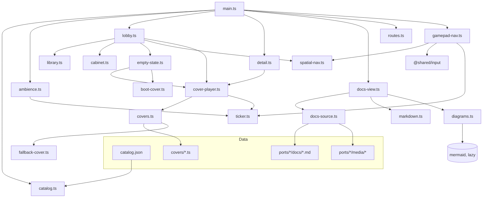
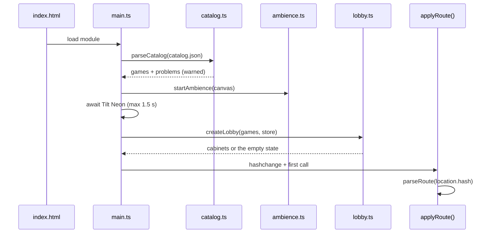
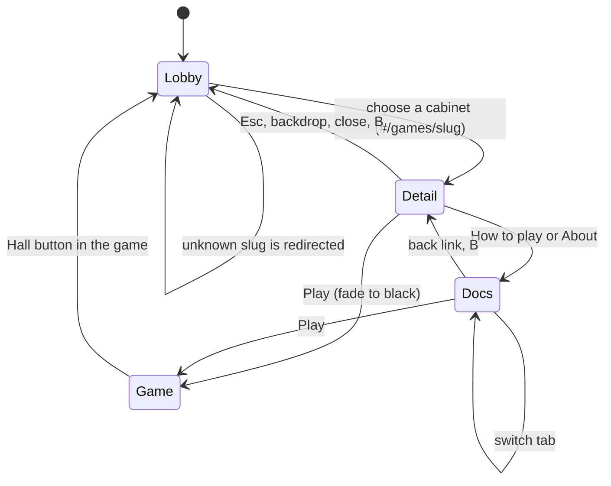
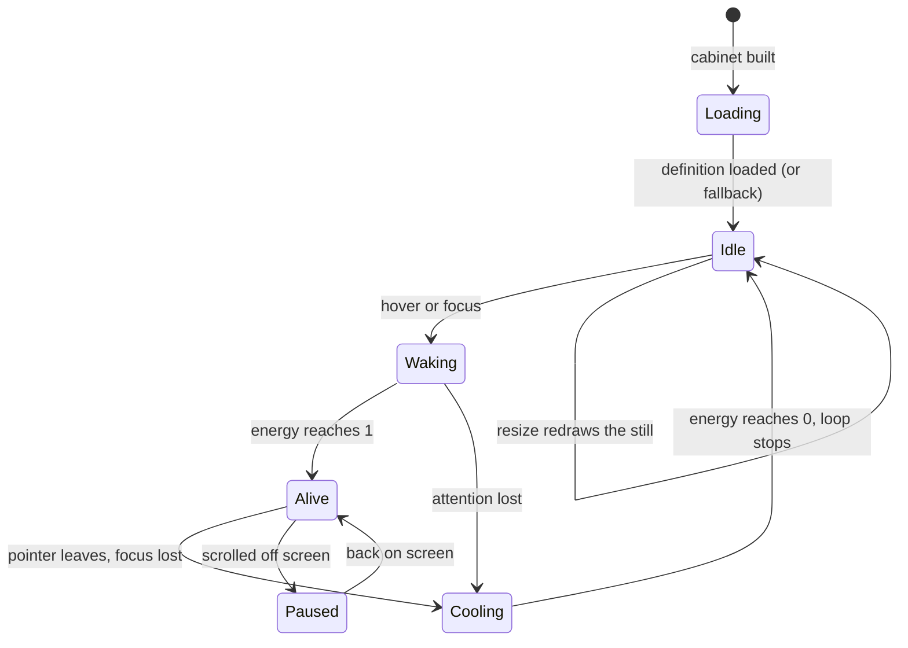
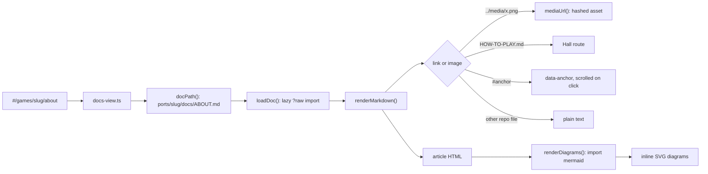

# Arcade Hall — architecture

The Hall is a single static page (`hall/index.html`) written in plain
TypeScript and DOM. It reads the catalog, draws a room full of cabinets,
and renders each game's player docs. This document is the map; the
contracts with ports are in [ADR 0002](adr/0002-hall-catalog-and-covers.md)
and the tooling in [ADR 0001](adr/0001-stack.md).

## Folder tree

```
hall/
├── index.html            page shell: ambience canvas, masthead, <main>, footer
├── catalog.json          the list of games (schema: ADR 0002)
├── favicon.svg           code-drawn cabinet icon
├── covers/               one animated cover per game, <cover-id>.ts
├── media/                screenshots of the Hall (with-demo/ proves a full game flow)
├── styles/
│   ├── base.css          tokens, reset, buttons, footer, launch fade, reduced motion
│   ├── masthead.css      neon logo, FREE PLAY lamp
│   ├── lobby.css         toolbar, grid, empty and no-results states
│   ├── cabinet.css       the cabinet built from boxes; hover/focus glow
│   ├── detail.css        detail dialog (centred panel, phone bottom sheet)
│   └── docs.css          docs bar and long-form "prose" typography
└── src/
    ├── main.ts           boot: catalog, ambience, lobby, docs, detail, router, gamepad
    ├── catalog.ts        GameEntry type, validation, formatting helpers
    ├── library.ts        genre list, search, filter and sort (pure)
    ├── routes.ts         hash routes <-> Route objects (pure)
    ├── spatial-nav.ts    "nearest box in this direction" (pure)
    ├── markdown.ts       Markdown -> HTML with repo-aware links and images
    ├── lobby.ts          toolbar, cabinet grid, roving focus, arrow keys
    ├── cabinet.ts        builds one cabinet element
    ├── empty-state.ts    dormant cabinets running their self-test
    ├── detail.ts         the detail <dialog>
    ├── docs-view.ts      the How to play / About page
    ├── docs-source.ts    bundled Markdown and screenshots from ports/
    ├── diagrams.ts       lazy Mermaid rendering in the Hall's theme
    ├── gamepad-nav.ts    gamepad-driven focus via @shared/input
    ├── launch.ts         game URLs and the fade-to-black on Play
    ├── cover-api.ts      the public cover contract (defineCover)
    ├── covers.ts         cover registry via import.meta.glob, with fallback
    ├── cover-player.ts   drives one cover on one canvas
    ├── fallback-cover.ts generic attract-mode cover
    ├── boot-cover.ts     self-test screen for the empty Hall
    ├── ambience.ts       the room: drifting lights, floor, dust
    ├── ticker.ts         one shared requestAnimationFrame loop
    ├── motion.ts         prefers-reduced-motion, live
    ├── colour.ts         hex helpers, readable ink on accents
    ├── dom.ts            h() element helper, icon(), isVisible()
    └── icons.ts          inline line icons
```

## Module map



## Boot and routing

`main.ts` validates the bundled catalog, starts the ambience, waits (at most
1.5 s) for the neon font so canvas text is right, then builds the lobby, the
docs view and the detail dialog and hands control to the router.



The URL hash is the single source of truth, so Back, reload and shared links
all work. Closing the dialog (Esc, backdrop, ×) or pressing B on a gamepad
only changes the hash; the router does the rest.



## Covers

Each canvas gets a `CoverPlayer`. It sizes the canvas to the device pixel
ratio (capped at 2), draws an idle still at `posterTime`, and animates only
while the cabinet has attention and is on screen. `energy` eases between 0
and 1 so covers can "power up". All animation shares one
`requestAnimationFrame` loop in `ticker.ts` that stops when nothing needs it.



With `prefers-reduced-motion`, players never animate: energy snaps to its
target and a single frame is drawn. If `create` or `draw` throws, the player
logs once and switches to the fallback cover.

## Docs rendering



Markdown and screenshots come from two `import.meta.glob` calls in
`docs-source.ts`, so they are bundled into the Hall at build time and work
the same on the dev server and on any static host.

## The room and the cabinets (where every visual lives)

| Visual | Drawn by |
|---|---|
| Drifting ceiling lights, floor pools, dust motes | `src/ambience.ts` (Canvas 2D at half resolution, max 30 fps) |
| Perspective floor grid and blacklight-carpet confetti | `paintFloor()` in `src/ambience.ts`, painted once per window size |
| Film grain | `.grain` in `styles/base.css` (inline SVG turbulence) |
| Neon logo, tube strike, flickering letter, FREE PLAY lamp | `styles/masthead.css` |
| Cabinet (marquee, screen bezel, deck, stick, buttons, coin door) | `src/cabinet.ts` markup + `styles/cabinet.css` |
| Cabinet wall glow, floor pool, hover lift, focus ring | `styles/cabinet.css` |
| Detail panel, bottom sheet, grab handle | `styles/detail.css` |
| Docs typography, tables, framed screenshots, diagram cards | `styles/docs.css`; Mermaid theme in `src/diagrams.ts` |
| Generic attract-mode cover | `src/fallback-cover.ts` |
| Empty-Hall self-test (static, colour bars, RAM test, PLEASE WAIT) | `src/boot-cover.ts` |
| Icons | `src/icons.ts` (inline SVG paths) |
| Favicon | `hall/favicon.svg` |

Palette tokens live at the top of `styles/base.css` (`--magenta`, `--cyan`,
`--violet`, `--amber`, ink levels). Each game's `accent` becomes the `--accent`
custom property on its cabinet, dialog and docs page; `inkOn()` in
`src/colour.ts` picks readable text for accent-filled buttons.

## Input

- **Pointer and touch:** everything is a real link or button.
- **Keyboard:** one cabinet is in the tab order (roving `tabindex`); arrow
  keys move between cabinets with `nearestInDirection()`, Home/End jump,
  Space opens, `/` focuses search, Esc clears search or closes the dialog.
- **Gamepad:** `gamepad-nav.ts` polls only while a pad is connected. Stick or
  d-pad moves focus to the nearest visible control (inside the dialog when
  it is open) with key-like auto-repeat; A presses, B goes back, LB/RB cycle
  genres, Start plays from the detail panel. The footer swaps its hints when
  a pad is in use (`html[data-input="gamepad"]`).

## Settings and state

| State | Where it lives |
|---|---|
| Current view, open game, open doc | URL hash (`routes.ts`) |
| Sort order (A–Z / Newest) | `localStorage` via `@shared/storage`, namespace `hall` |
| Search text, genre filter | memory (reset on reload, on purpose) |
| Reduced motion | the OS setting, watched live (`motion.ts`) |

## Tests

| Layer | Where | What |
|---|---|---|
| Pure logic | `hall/src/*.test.ts` (Vitest) | catalog validation, the **real catalog** guard, search/sort, routes, spatial navigation, Markdown links/images/sanitising |
| Shared modules | `shared/*/*.test.ts` | rng, loop, storage, input, audio, fx, hall-link |
| Browser | `e2e/hall.spec.ts` (Playwright, desktop + phone) | clean boot, empty state or cabinets, dialog + Esc, keyboard path, search, docs with diagrams, Play and back, game self-containment |
| Screenshots | `e2e/hall.screens.ts` | lobby, focus, detail, docs at 1440×900, 1024×768, 390×844 |

## How to extend

- **Add a game:** follow the checklist in ADR 0002. No Hall code changes.
- **Add a catalog field:** extend `GameEntry` and `entryProblems()` in
  `catalog.ts`, add a test, update ADR 0002, then use it in `cabinet.ts` or
  `detail.ts`.
- **Add a sort order:** extend `SortOrder` and `selectGames()` in
  `library.ts` and `SORT_LABELS` in `lobby.ts`.
- **Add a doc page type** (e.g. a changelog): add a `DocKind` in `routes.ts`,
  a label in `docs-view.ts`, a path in `docPath()` and a catalog field.
- **Change the room:** lights are the `LIGHTS` table in `ambience.ts`; the
  floor is `paintFloor()`. Keep it slow; it sits behind everything.
- **Change the cabinet:** markup in `cabinet.ts` (`buildMachine`, also used
  by the empty state) and styles in `cabinet.css`.
