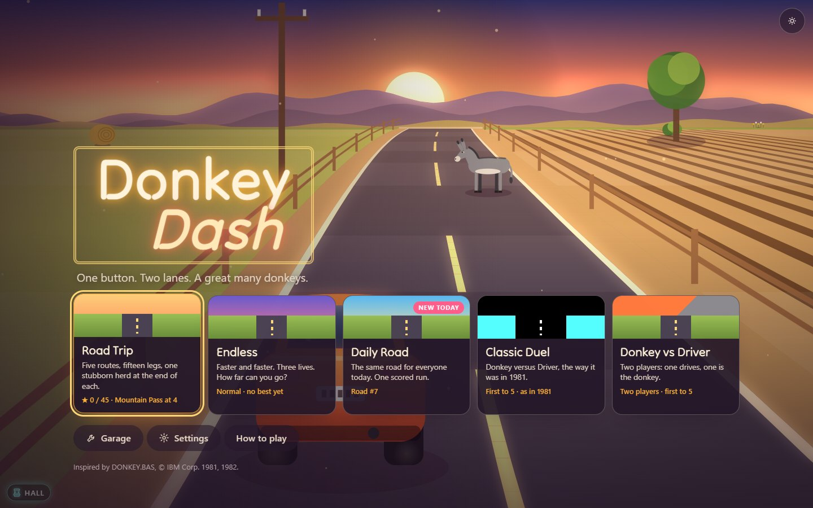
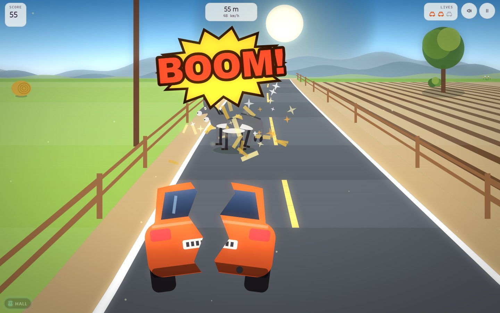
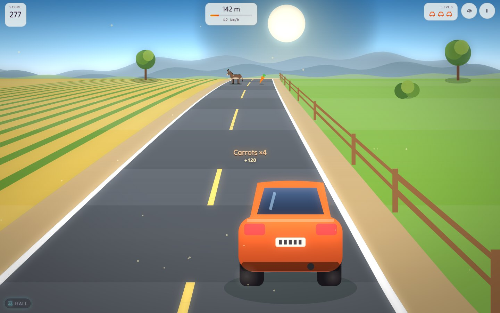

# About Donkey Dash

*Inspired by DONKEY.BAS, © IBM Corp. 1981, 1982.*

There is a donkey in the road. There is always a donkey in the road. You
have one button, two lanes and about two-thirds of a second, and the donkey
has no intention of moving.

## The original

| | |
|---|---|
| **Title** | The IBM Personal Computer Donkey (`DONKEY.BAS`), Version 1.10 |
| **By** | IBM, with the program written at Microsoft (see below) |
| **Year** | 1981, with a 1982 revision (the copyright lines of the listing) |
| **Language** | IBM Advanced BASIC (BASICA) |
| **Platform** | The IBM Personal Computer, with the Color/Graphics Adapter |
| **Where it appeared** | A sample program on the PC DOS disk that came with the first IBM PC |

In August 1981 the IBM Personal Computer arrived with a handful of BASIC
sample programs on its DOS disk, and one of them was a game about a car and
a donkey. You switched on the machine, typed `BASICA DONKEY`, got a green
double-line box that said DONKEY, and pressed the space bar. A tiny car sat
at the bottom of a four-colour road. A donkey fell out of the top of the
screen. You pressed a key, the car jumped into the other lane, and the
donkey went by. Then another donkey. Then another.

It was a demonstration as much as a game: of the Color/Graphics Adapter's
four colours, of `DRAW` and `GET` and `PUT`, of the speaker (it refused to
run without Advanced BASIC because it needed `PLAY`). The program is short
enough to read in one sitting, and plenty of people did.

The story most often told about it is that Bill Gates and Neil Konzen of
Microsoft, which wrote the PC's BASIC, put it together in a night to show
off what the new machine could do. It has been retold, and teased, many
times since. Nobody on the road seems to have asked the donkey.

### Why people remember it

- **The crash.** "BOOM!", then the car and the donkey both split down the
  middle and the four halves slide off into the four corners of the screen,
  slowly at first, then all at once. It is absurd, and it is the moment
  everyone who played it describes first.
- **Donkey versus Driver.** The score panel keeps two tallies side by side:
  a point for the Donkey every time you crash, a point for the Driver when
  you reach the top. The donkey is your opponent, and it is winning.
- **The climb.** Each donkey dodged moves your car a little way up the
  screen, which quietly leaves you less time to see the next one. By the
  eleventh donkey you have less than a third of a second. That one hidden
  rule is why it is harder than it looks.

## This version

Donkey Dash keeps all of that and builds a road trip around it.

**What stays the same**

- One button, two lanes, instant switches. Every press is a lane change.
- **Classic Duel** plays the original's rules to the letter: the same
  donkey speed, the same random start, the same eleven dodges to the top
  and the same shrinking reaction window, 0.67 s down to 0.30 s. The score
  is still Donkey against Driver; now the first to five (or any number up
  to eleven) wins the match.
- The crash is still the star, played on the original's own accelerating
  curve: a slow-motion beat, a comic BOOM!, and four halves spinning off to
  the four corners.
- The green double-line box opens the game, types DONKEY, and unfolds into
  the new logo.

**What is new**

- **Three ways to watch.** *Chase* puts you behind the car, OutRun style,
  with donkeys trotting over the crest of a hill. *Classic* is top-down
  like 1981, tilted into a little diorama. *Isometric* turns the road into
  a model world with a windmill, hay bales and the odd river bridge. Every
  view shows a donkey at exactly the same moment, so none of them is easier.
- **Road Trip.** Five routes of three legs each: Farm Lanes, Mountain Pass,
  Desert Highway, Foggy Night and Snow Road, each with its own light,
  weather and soundtrack, and a stubborn herd waiting at the end. Earn up
  to three stars a leg.
- **Endless.** The road speeds up until you have used all three lives. How
  far can you go?
- **Daily Road.** One road a day, the same for everyone, one scored run,
  and a spoiler-free result to share. Keep a streak going.
- **Donkey vs Driver.** A friend takes the donkey: they choose its lane,
  feint, and must make up their mind before a line on the road. Swap roles
  after every point. One keyboard, one screen, or two gamepads.
- **Near misses and rhythm.** Leave a donkey's lane at the last moment for
  "Close shave!", "Whisker!" or "Hee-haw-some!", chain them for a combo,
  and switch on the beat of the music for a bonus.
- **New hazards, one at a time.** Donkey pairs, hesitant donkeys that
  wobble before they commit, herds with one gap, mud that slows your
  switch, stretches where the road widens to three lanes, and carrots worth
  grabbing. A road sign always warns you first.
- **A garage** of bodies, paints, horns, trails and hats for the
  two-player donkey, earned through play and the Arcade Pass.
- **A CGA filter**, for anyone who misses cyan and magenta.

## Why play it today

Because it is the purest one-button game there is, and it still works.
Donkey Dash is a two-minute game on a phone and a two-hour argument on a
sofa. Classic Duel is 1981 exactly, if you want to know what it felt like.
Everything else is the same idea, given a little more road.
