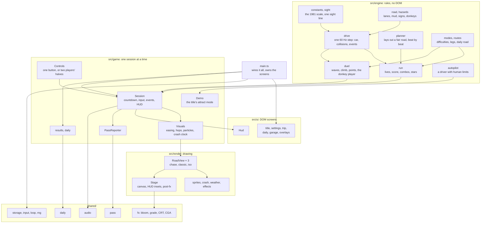
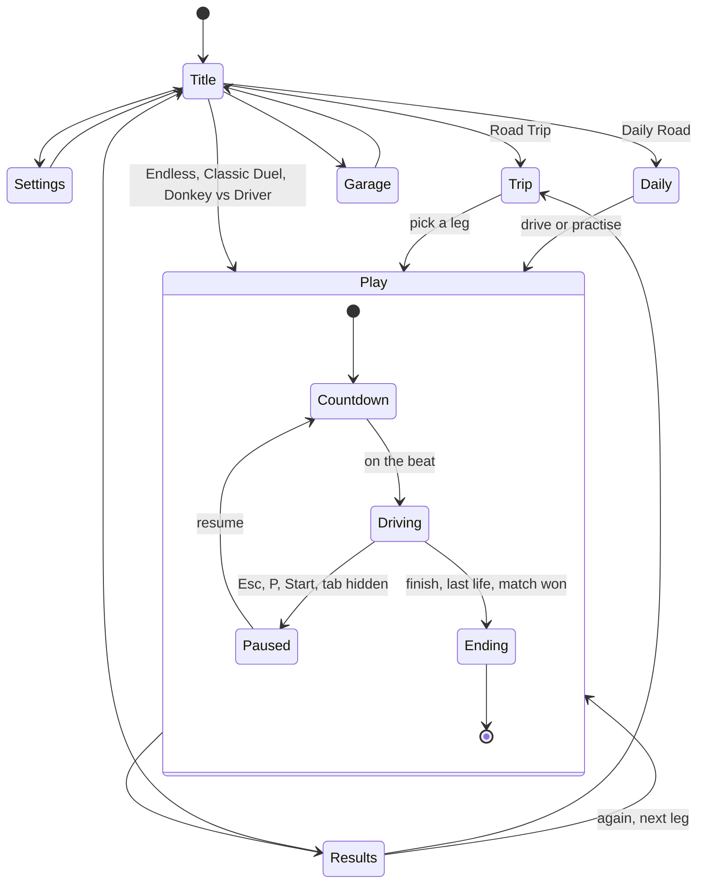
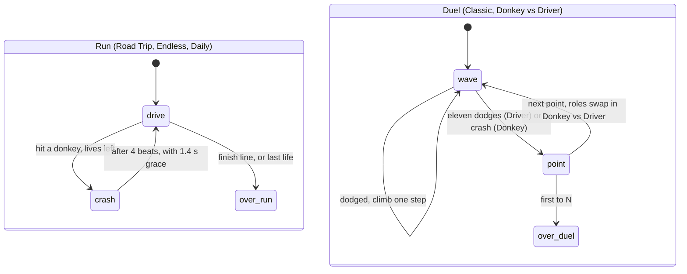
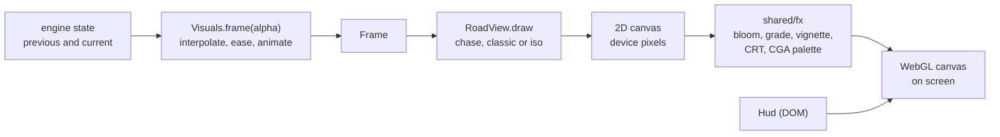
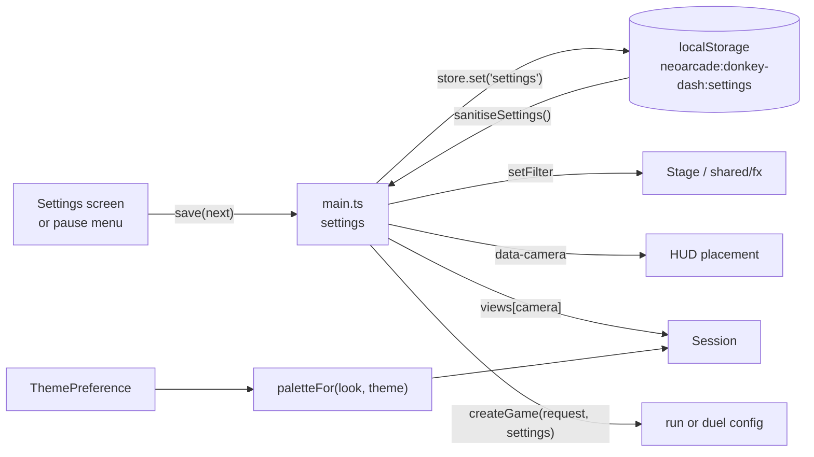

# Donkey Dash — architecture

Donkey Dash is a TypeScript page built with Vite, like every NeoArcade port.
The rules live in a plain engine with no DOM, a seeded random generator and
nothing but exact arithmetic, so a road plays out the same in Node, in
Chromium, in Firefox and in WebKit. Everything the player sees and hears is
a layer on top that reads the engine and never writes back to it.

## Module overview



The engine knows nothing about the other layers. `game/` turns engine state
into a `Frame` and engine events into sounds, pop-ups and Arcade Pass
progress. `render/` paints a `Frame`. `ui/` is plain DOM.

## Folder tree

```
ports/donkey-dash/
├── index.html                  the page: stage, HUD and screens mount here
├── favicon.svg                 the road and a donkey's ears, in SVG
├── pass.manifest.ts            Arcade Pass badges, cosmetics and stats
├── playwright.config.ts        browser test projects
├── README.md
├── docs/                       ABOUT, HOW-TO-PLAY, this file
├── media/                      screenshots for the docs and the Hall
├── e2e/
│   ├── helpers.ts              fake clock, opening the game, waiting on <body> data
│   ├── game.spec.ts            smoke tests, desktop and phone
│   ├── engine.determinism.ts   the engine fingerprint in Chromium, Firefox, WebKit
│   ├── drive.playtest.ts       a scripted player: tuning numbers, taps and keys vs Node
│   └── art.screens.ts          screenshots of every mode, view and route
└── src/
    ├── main.ts                 wiring: screens, sessions, settings, the loop
    ├── settings.ts             the settings shape, defaults, sanitising
    ├── theme.ts                light or dark, following the device or a choice
    ├── garage.ts               bodies, paints, horns, trails, hats; the loadout
    ├── progress.ts             Road Trip stars and bests, the donkey streak
    ├── styles.css              every screen and the HUD, light and dark
    ├── engine/
    │   ├── constants.ts        the 1981 geometry and the port's fixed numbers
    │   ├── sight.ts            revealGap and the reaction window
    │   ├── road.ts             lane stretches, mud, signs, lateral positions
    │   ├── hazards.ts          donkeys and carrots
    │   ├── scoring.ts          near-miss tiers, combo, rhythm
    │   ├── drive.ts            the car, stepping, collisions, drive events
    │   ├── planner.ts          RoadPlanner: phrases on the beat, feasibility
    │   ├── run.ts              Road Trip, Endless, Daily: lives, score, stars
    │   ├── duel.ts             Classic Duel and Donkey vs Driver
    │   ├── modes.ts            difficulties, Endless and Daily configs
    │   ├── routes.ts           five routes, fifteen legs
    │   ├── autopilot.ts        a driver with a reaction time and a thumb
    │   └── fingerprint.ts      hashes many runs for the cross-browser check
    ├── game/
    │   ├── session.ts          one mode being played, start to results
    │   ├── visuals.ts          engine state to Frame: easing and animation
    │   ├── controls.ts         bindings for one player or two
    │   ├── pass-report.ts      counts during play, reports at the end
    │   ├── results.ts          the results card for every outcome
    │   ├── daily.ts            the daily challenge, its strip and share text
    │   └── demo.ts             the title screen's self-driving road
    ├── render/
    │   ├── view.ts             RoadView, Frame, Viewport, ViewLayout
    │   ├── views.ts            the three views
    │   ├── chase-view.ts       behind the car, to a crest at the sight line
    │   ├── classic-view.ts     top-down diorama, hedgerow at the sight line
    │   ├── iso-view.ts         2:1 model world, stretched to the screen edge
    │   ├── iso.ts              iso projection, boxes, the iso car and donkey
    │   ├── crash.ts            the four-corner crash and the BOOM!
    │   ├── effects.ts          particles: dust, hay, sparks, trails, confetti
    │   ├── weather.ts          pollen, mist, heat, fireflies, snow
    │   ├── palette.ts          every look, light and dark; coats; mixing
    │   ├── scenery.ts          where props, poles and fences stand
    │   ├── fields.ts           farmland parcels beside the road
    │   ├── stage.ts            the canvas, HUD insets, post-processing
    │   ├── layout.test.ts      the fairness tests for all three views
    │   └── sprites/            car, donkey, props, carrots, signs, flags
    ├── audio/
    │   ├── sounds.ts           sound effects, horns, jingles, the hee-haw
    │   └── music.ts            one arrangement per route and mode
    └── ui/
        ├── dom.ts, icons.ts    tiny DOM helpers and inline SVG icons
        ├── title-screen.ts     logo, the 1981 box, mode cards
        ├── settings-screen.ts  every setting
        ├── trip-screen.ts      routes, legs and stars
        ├── daily-screen.ts     today's road, streak, calendar
        ├── garage-screen.ts    preview and parts
        ├── overlays.ts         pause menu, results, share box
        ├── hud.ts              plates, pop-ups, captions, countdown
        └── menu-nav.ts         arrow keys and gamepads in menus
```

Shared code this port added or extended: `shared/daily/` (day keys, seeds,
streaks, the daily log, sharing; see [ADR 0009](../../../docs/adr/0009-daily-challenges.md))
and the palette stage of `shared/fx/` (the CGA filter).

## The loop and the state machine

`shared/loop` calls `update()` at a fixed 60 Hz and `render(alpha)` once
per display frame. Each update reads input, steps the engine once and
reacts to its events; each render interpolates the last two states into a
`Frame` and draws it. Nothing in `render` changes the game.

The page moves between screens; a session lives only on the play screen:



Inside the engine, a run and a duel each have a small phase machine:



The countdown is timed so that "Go!" falls on a beat of the music: the
planner put every donkey row on the half-beat grid, so the donkeys arrive
in time with the song (`Session.countIn`).

## Engine rules and formulas

**One sight line.** Everything hangs on `SIGHT_DISTANCE`, 16 m: the 77
pixels between where DONKEY.BAS first draws a donkey and the car's bumper.
That fixes the scale: 1 pixel = 16/77 m, and the original's donkey (6 pixels
a timer tick, 18.2 ticks a second) moves at 22.7 m/s.

- `revealGap(climb) = SIGHT_DISTANCE − climb × CLIMB_STEP`, with
  `CLIMB_STEP` = 4 pixels = 0.83 m. A hazard exists for the player only
  once it is within `revealGap` of the car's nose.
- `reactionWindow(speed, climb) = revealGap(climb) / speed`: from 0.67 s
  to 0.30 s in Classic Duel, as in 1981.

**Stepping** (`drive.ts`). 60 steps a second. A press switches lanes at
once (in mud, after `MUD_DELAY`, 0.15 s). A donkey hits if it overlaps the
car's lane while any part of it is within the car's 4.5 m (plus its own
1.2 m). Only integer and IEEE-exact operations are used: no `Math.sin`,
`exp`, `pow` or `sqrt` in the engine, so every browser computes the same
bits. A test scans the engine source for them.

**Runs** (`run.ts`, `planner.ts`, `modes.ts`, `routes.ts`).

- The road is planned a phrase at a time on a half-beat grid, with the
  speed constant within each beat: `v = start + (max − start) × k / (k + ramp)`
  for beat `k`, so every row lands on the beat whatever the speed.
- A phrase is placed only if a player can do it: clear the rows before it,
  press as often as needed (`PRESS_SECONDS` 0.14 s each, plus mud), and
  still see the next row `REACTION_SECONDS` (0.3 s) before having to move,
  with the route's slack on top. A row that does not fit waits: the planner
  moves it later, half a beat at a time, until it does.
- New kinds of hazard are introduced by beat number, each behind a road
  sign; a boss leg ends in a stubborn herd of fourteen rows.
- Near misses: leaving the donkey's lane within 0.32, 0.20 or 0.10 s of the
  hit scores 50, 100 or 200, times the combo multiplier
  `min(5, 2 + ⌊(n − 2) / 2⌋)` from the second in a row.
- Rhythm: a switch within 0.075 s of a beat scores 15 × the multiplier.
- A crash costs a life and freezes the road for `CRASH_BEATS` (4 beats),
  then `GRACE_SECONDS` (1.4 s) of immunity.
- Score = metres driven + near-miss, carrot and rhythm points.

**Duels** (`duel.ts`). A wave is one donkey in a random lane, starting up
to 32 pixels above the top of the original's screen and falling at
`CLASSIC_SPEED`; the next wave begins when it reaches the original's y 124. Eleven dodges win a point
(`WINNING_CLIMB`). In Donkey vs Driver the road runs at 13.5 m/s, the
donkey player's presses hop the donkey (or move the drop marker between
waves), and the donkey stops listening `VERSUS_COMMIT_SECONDS` (0.45 s)
before it would reach the car: see [ADR 0011](../../../docs/adr/0011-two-player-donkey.md).

**The autopilot** (`autopilot.ts`) drives with a reaction time, a gap
between presses and optional daring (waiting for near misses). It notices a
hesitant donkey twice: when it appears and when it commits. It runs the
title demo, proves in tests that every planned road can be finished, and
plays the playtests.

## Rendering pipeline



Each view draws back to front: sky or ground, the road as a few large
polygons (so no seams show), a sorted list of sprites (props, fences,
signs, donkeys, carrots, the car), particles, the night overlay and
headlights, weather, and last the crash. `Stage` sizes the canvas to the
device (at most 2× pixels), works out the `Viewport` with room for the HUD
bar (`hudInsets`), and hands the result to `shared/fx`.

**Fair sight in every view** ([ADR 0010](../../../docs/adr/0010-camera-views-and-fair-sight.md)).
`RoadView.layout()` is pure: given a viewport and a climb it says where a
donkey at any gap stands on screen. The layout tests check, for four screen
sizes, every climb and every lane, that a donkey at the sight line is
entirely on screen and below the HUD, and that nothing of the road beyond
it is drawn. The views meet that in their own way:

- **Chase**: the road rises to a crest placed exactly at the sight line;
  distance ahead is stretched so the crest sits at a good height, and the
  crest moves in as the duel climb shrinks the sight line.
- **Classic**: true scale; a hedgerow covers the road beyond the sight line
  and the car climbs the screen in the duels.
- **Isometric**: the reach ahead is found by binary search so a donkey on
  the sight line, in any lane, just fits inside the top-right of the screen.
  Tall props stand only on the far side of the road.

## Where every visual "asset" lives

There are no image files in the game; everything is drawn by code.

| What | Where |
|---|---|
| The car from behind, from above, in iso | `sprites/car.ts` (`drawCarRear`, `drawCarTop`), `iso.ts` (`drawIsoCar`) |
| The donkey, side on, with coats, hats, startle, daze and dizzy stars | `sprites/donkey.ts`; iso blocks in `iso.ts` (`drawIsoDonkey`) |
| Trees, pines, cacti, mesas, rocks, hay, windmill, snowmen, flowers, poles | `sprites/props.ts`; iso versions in `iso-view.ts` |
| Carrots, road signs, the chequered flag | `sprites/bits.ts` |
| Farmland parcels and crop rows | `fields.ts`, drawn by each view |
| Sky, sun, crescent moon, mountains, snow caps, haze | `chase-view.ts` (`drawBackdrop`, `ridge`, `snowCaps`) |
| Hedgerow and red-rock rim at the sight line | `classic-view.ts` (`drawHedgerow`) |
| Headlights and the night overlay | `drawNight` in each view |
| The crash, BOOM! and flash | `crash.ts` |
| Particles and garage trails | `effects.ts` |
| Weather | `weather.ts` |
| Every colour: five looks × light and dark, coats, crops | `palette.ts` |
| Bloom, grade, CRT, CGA | `stage.ts` settings for `shared/fx` |
| Title logo, the 1981 box, mode card art, icons | `styles.css`, `ui/title-screen.ts`, `ui/icons.ts` |
| The Hall's animated cover | `hall/covers/donkey-dash.ts` |

**Audio** is synthesized with `shared/audio`. `audio/sounds.ts` holds the
effect patches (lane whoosh, mud squelch, crash, carrot, beat tick, count-in
and go, hop, commit, sign), the near-miss chimes that climb with the combo,
the hee-haw (two brays, each a rising "hee" and a falling "haw" on a
filtered sawtooth), the horns and the jingles.
`audio/music.ts` builds each song from shared patches (kick, snare, hat,
bass, a motor drone, pad, arpeggio, lead) and a short arrangement per route,
Endless, Daily and the title; the tempo of each is the beat the planner
uses.

## How settings flow



Settings are read when a session starts; the camera is looked up every
frame, so switching it in the pause menu takes effect at once. Theme is
kept separately (`theme.ts`), follows `prefers-color-scheme` unless chosen,
and picks the light or dark version of each look. Everything stored goes
through `shared/storage` under the `donkey-dash` namespace and is sanitised
on the way back in.

## Tests

- **Engine** (Vitest, `src/engine/*.test.ts`): the 1981 numbers
  (`original.test.ts`), stepping and collisions, duels and the commit line,
  the planner's fairness and determinism, including a source scan for
  inexact maths, runs, stars and scoring, and the engine fingerprint.
- **Views**: `render/layout.test.ts` checks fair sight in all three views.
- **Game and UI logic**: settings, progress, daily share text, the Pass
  reporter, music.
- **Browser** (Playwright, `e2e/`):
  - `game.spec.ts` (`smoke` and `phone` projects): boot, one-button input,
    pause and camera switch, the daily flow, duels, two-player keys, locked
    routes and garage items, theme and reduced motion.
  - `engine.determinism.ts`: the same fingerprint in Chromium, Firefox and
    WebKit.
  - `drive.playtest.ts`: a phone-speed scripted player plays hundreds of
    runs in Node for the tuning numbers, then taps through a Road Trip leg
    and keys through an Endless run in the real page, which must end where
    Node says.
  - `art.screens.ts`: screenshots, reached by replaying a planned drive.

## How to extend

**Add a hazard.** Add a `PhraseKind` and a builder in `planner.ts` that
places rows through `placeRow` (which runs the feasibility check), a
`SignKind` and caption if it needs introducing, and a beat number in the
`introduce` table of the routes that should have it. Draw anything new in
all three views. The planner tests will fail if the pattern can be
impossible.

**Add a route.** Add a `RouteId`, a `Route` in `routes.ts` (legs, speeds,
targets, stars to unlock), a look in `palette.ts` (both themes), an
arrangement in `music.ts`, and a card colour in `styles.css`. `TOTAL_STARS`
follows the number of routes.

**Add a camera view.** Implement `RoadView` (a pure `layout()` and `draw()`),
register it in `views.ts` and `CAMERA_NAMES`, and add it to the fairness
tests. Draw hazards only within `layout.sightAhead`.

**Tweak difficulty.** Speeds are in `DIFFICULTY_RULES` (`modes.ts`) and in
each leg; windows are `16 / speed` seconds. Run the playtest project to see
the new survival times before and after.

**Tweak the autopilot.** `createAutopilot` options: `reactionSeconds`,
`pressGap`, `daring`, `greedy`. The demo uses a relaxed one; the tests use a
0.3 s driver, and the playtests a 0.42 s phone player who sometimes
hesitates.

**Add a garage item.** Add it to `garage.ts`; if it should be earned, add a
cosmetic to `pass.manifest.ts` with a level or badge unlock and the same id.

## Arcade Pass

The manifest (`pass.manifest.ts`) declares 25 badges (four of them secret),
23 cosmetics and 8 stats. `main.ts` connects it with `connectPass` and
mounts the shared unlock toasts.

**Counting during play.** `PassReporter.observe` sees every engine event
and only counts: donkeys dodged, near misses (and Whisker-or-better ones),
carrots, on-beat switches, hesitant donkeys dodged, the best combo. A few
badges unlock on the spot because the moment itself is the badge: Close
Shave (first near miss), Hee-Haw-Some Streak (a ×5 combo), Mud Bath
(dodging with your wheels in mud), Three's a Crowd (leaving a three-lane
stretch without a crash) and the secret Worth It (crashing just after a
carrot).

**Committing.** `commit()` sends the counts as progress on the counted
badges (Hee-Haw Hundred, Carrot Cake, Whisker Master, On the Beat, Make Up
Your Mind) and as stats (dodged, near misses, carrots, best combo). It runs
when a session ends, when the player leaves mid-run, and on `pagehide`, so
the profile is written a handful of times per run.

**XP and end-of-run badges.**

| Moment | XP | Badges and stats |
|---|---|---|
| An Endless run ends | 10, +10 per km (up to +40) | Long Haul at 3,000 m; `bestEndless` |
| A scored Daily Road | 30, or 40 if finished | Early Bird; Clean Sheet (no crash); Daily Driver (7-day streak); `bestStreak` |
| A Daily practice run | 10 | — |
| A Road Trip leg finished | 40 + 10 per new star, +100 for a first boss | Learner's Permit; Herd Immunity (third leg); Zero Donkeys Harmed; Road Tripper; Forty-Five Stars; `stars` |
| A Road Trip leg not finished | 10 | — |
| A Classic Duel point to the Driver | — | Donkey Loses! |
| A Classic Duel match | 35 won, 10 lost | Donkey Whisperer (won without conceding a point); secret Retro Rig (all in CGA) |
| A Donkey vs Driver match | 15 | Donkey Supreme (winning point scored as the donkey) |
| Any match | — | secret Stubborn (ten points in a row to the Donkey) |
| Any run | — | secret Photo Finish (finish on the last life); `runs` |

**Cosmetics** unlock at Arcade levels 2 to 20 or with badges, and appear
in the garage; a locked item shows how to earn it.

**Toasts.** The toasts are held while a session is playing
(`toasts.hold()` in `startSession`) and flushed when the results appear or
the player returns to a menu (`toasts.flush()`), so a badge never covers
the road.
