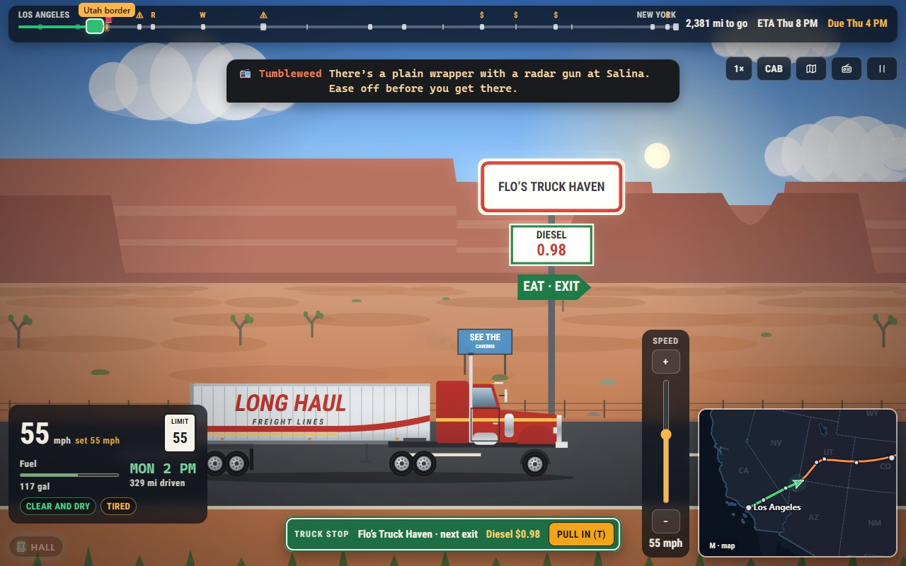

# Long Haul

Los Angeles to New York, Monday 8 AM, due Thursday at 4 PM. Pick a cargo,
a weight, some tyres and a road, then decide, hour by hour, how fast to go,
when to stop for diesel and when to sleep: every mile is money against
time. Long Haul keeps the rules, the routes and the verdicts of an early-1980s
GW-BASIC game, and builds a country around them: a real-time drive or the
original's leg-by-leg rhythm, a side-on diorama of the landscapes or the
view from the cab, truck stops with names, a CB full of tips, postcards, a
Career across nineteen cities, a Daily Haul everyone drives the same, and
the original green-screen prompts for anyone who misses them.

*Inspired by Trucker by Hughes Glantzberg.*



## Run it

From the repository root:

```sh
npm install
npm run dev     # then open http://localhost:5173/ports/long-haul/
npm run build   # the built game is in dist/long-haul/
```

Tests: `npm test` runs the engine tests. The browser tests are

```sh
npx playwright test -c ports/long-haul --project=smoke --project=phone
npx playwright test -c ports/long-haul --project='determinism-*'
npx playwright test -c ports/long-haul --project=playtest
npx playwright test -c ports/long-haul --project=screens
```

The playtest drives whole trips through the real page and checks that every
logbook adds up; `screens` renders every screen at four sizes in both themes
for art direction.

Balance: `npx tsx ports/long-haul/scripts/balance.ts` (thousands of Single
Hauls per driver, route and cargo) and `scripts/career-sim.ts` (whole
careers). The results are in the behaviour notes.

## Read more

- [About](docs/ABOUT.md): the original, and what this version adds.
- [How to play](docs/HOW-TO-PLAY.md): controls, modes, settings, tips.
- [Architecture](docs/ARCHITECTURE.md): how the code fits together.
- [Behaviour notes, bugs fixed, change log and balance](../../docs/games/long-haul.md).
- Decisions: [map data](../../docs/adr/0015-long-haul-map-data.md),
  [the hour-tick engine](../../docs/adr/0016-long-haul-hour-engine.md),
  [the corridor network](../../docs/adr/0017-long-haul-corridors.md).

## Credit

Based on *Trucker* by Hughes Glantzberg, a GW-BASIC program from the early
1980s. This version is a new program written from scratch: no code, title
screen or text layout was copied beyond the game's own lines of dialogue,
which it quotes; every picture and sound is made by code. The map of the
United States comes from [Natural Earth](https://www.naturalearthdata.com/)
(public domain).
