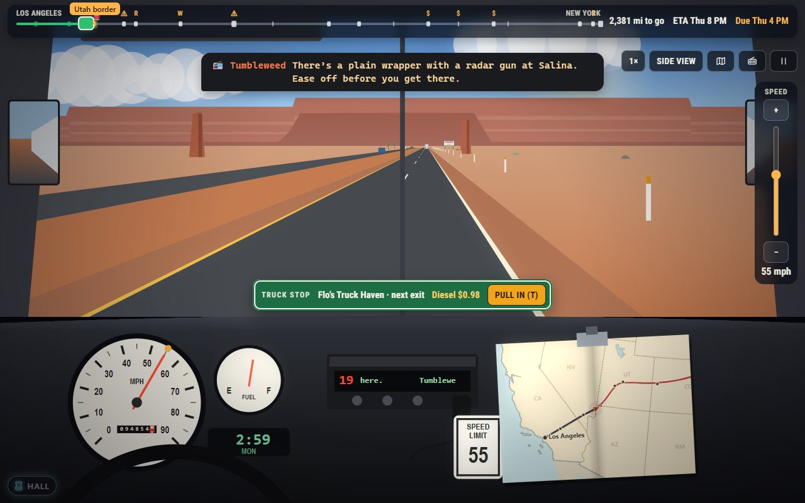
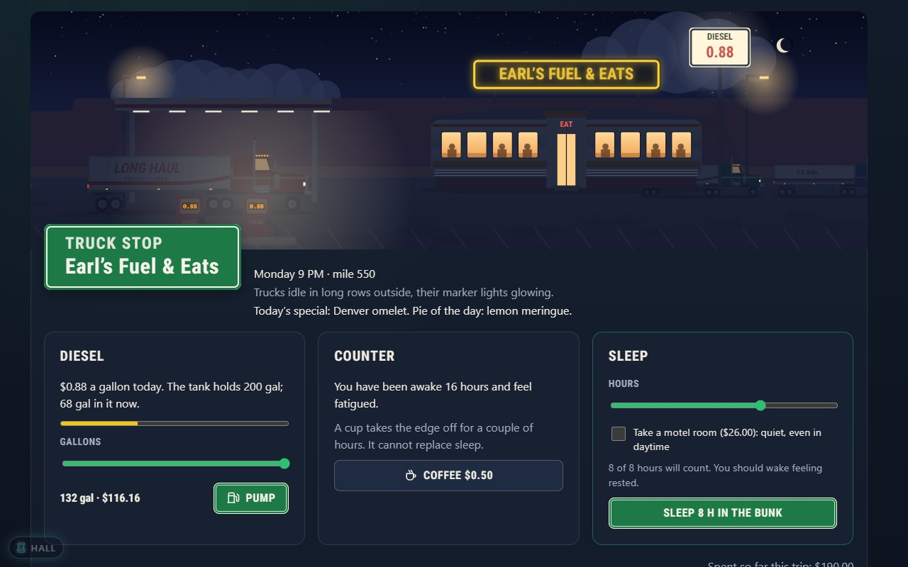

# About Long Haul

Los Angeles, Monday, 8 AM. There are 190 gallons of diesel in the tank, two
worn tyres under the trailer, 38,000 pounds of oranges behind you and 2,850
miles of interstate between you and New York. The load is due Thursday at
4 PM. Every mile is money against time: drive faster and the patrols notice,
the tyres go, and the old rig drinks diesel; sleep too little and you will
not see the pick-up in the fog; sleep too much and the oranges start to go.

*Long Haul* is a remake of **Trucker**, and it plays the same way: an hour at
a time, one decision after another, until the warehouse doors open or the
road ends you first.

## The original

**Trucker** was written by **Hughes Glantzberg** for the IBM PC in
**GW-BASIC**, in the **early 1980s**. It is a single 386-line program; its
title is drawn in double-line box characters across the whole screen, with
"by Hughes Glantzberg" in a little box below. Its last lines run a program
called `menu`, so it was one game on a menu-driven disk collection; we have
not found which one, or the year it was written, so this page says no more
than that.

What the program offers is simple to describe and hard to master. You pick
a cargo (oranges for the best money if they arrive fresh, freight with a
deadline, or the U.S. Mail at the lowest rate but no hurry), a weight, some
tyres and one of three roads: the northern route over the Rockies, the
middle one along I-40 and I-70, or the long, easygoing southern route. Then,
every hour, the program asks how fast you wish to go.

Behind that question sits a surprisingly complete little model of the job.
The crash risk grows with the square of your speed, multiplied by how tired
you are and how bad the road is. The tyres wear, and the further you go the
likelier a blowout. Each route has its own temper: strict patrols and good
roads in the north, the reverse in the south. Fuel economy is best at 55 and
falls away on either side. Truck stops come every few hours, with fuel,
food and a bunk, but sleep in the daytime "thanks to the daytime noise"
only half counts. Along the way the tables hold toll roads, construction,
radar traps, weigh stations, a rock slide at the Allegheny tunnel, a
refrigeration unit that fails, and Louisiana, which turns overweight trucks
away. At the end the dock pays by the pound, the truck payment takes $85 a
day, and the program gives its verdict.

### Why people remember it

The verdicts. "G O O D   W O R K  !!" when the trip clears $100. "You'd make
more money washing dishes !" when it does not. "DUMMY !!" in bright white
when you run out of fuel. "Speed kills !" when you meet the consequences of
your throttle. It is a game about patience disguised as a game about speed,
and the program has opinions about how you drive.

It also had its bugs, and some of them are wonderful: buying a tyre at a
truck stop stops the program dead; changing one makes the driver instantly
exhausted; the warehouse that is supposed to close at night never does; and
the penalty for late freight is announced but never taken. The port fixes
them all and lists every one in
[the behaviour notes](../../../docs/games/long-haul.md).

## This version

*Long Haul* keeps the original's rules, its three routes and its words, and
builds a country around them.

**Drive it your way.** In *real time* the hours roll by in about three
seconds each while you work the throttle, and anything serious stops the
clock: a blowout, a patrol car, a scale that is open today. *Leg by leg*
plays the original's rhythm: choose a speed at each waypoint, then watch the
leg go by. And for anyone who misses the green screen, the *text mode* in the settings
plays the trip as green text on black, prompts and all.

**Two ways to see the road.** The side view is a diorama of the country you
are crossing, drawn entirely in code: Joshua trees in the Mojave, red mesas
in Arizona, the high plains, the Ozarks, cornfields, the Rockies, the tunnels
of Appalachia, the Turnpike, and Manhattan lit up at night, under a sky that
follows the real sun. The cab view puts you behind the split windscreen,
with the speedometer, the fuel gauge, a CB set and a road atlas clipped to
the dash. Weather is on the glass, the wipers work, frost creeps in, and when
the driver gets tired the edges of the world start to close in.

**Always know where you are.** A route strip across the top shows every
waypoint, the next truck stop, the miles to go, your ETA and whether you
will make the deadline. The full map, one key away, shows the trail you
have driven coloured by speed, every stop and ticket and blowout along it,
the storms drifting across the country and the night line moving west.

**Truck stops with names.** Flo's Truck Haven, Earl's Fuel & Eats: each stop
is a diner with a neon sign, a special and a pie of the day. Fill the tank,
buy a spare, have a coffee, sleep in the bunk or take a motel room.

**Channel 19.** Eighteen regulars talk on the CB: tips about radar traps,
scales and weather ahead, which are right most of the time — some drivers
more than others, and you will learn who to trust. And postcards: pass a
town for the first time and its card goes in your album, a big-letter
"Greetings from" card with two lines about the place.

**More road.** *Single Haul* is the original run, and now the return trip too.
*Career* gives you an old rig, $1,000 and a job board in Los Angeles:
nineteen cities joined by real interstates, contracts that pay by the
pound and the mile, upgrades (saddle tanks, a sleeper cab, a radar detector
with a catch), seasons, and a reputation that opens up the long, well-paid
runs. *Daily Haul* is one load a day, the same for everyone in the world, with
a streak and a line to share.

**The Arcade Pass.** Twenty-seven badges, from *Coast to Coast* to the
*Million-Mile Club*, a few secret ones for the moments the original
would have laughed at, and five rig paints to unlock.

## Why play it today

Because it is a different kind of tension. There are no enemies and no
timer on screen, just the arithmetic of a long day: one more hour before
sleep, five more miles an hour, a cheaper truck stop fifty miles on. The
original understood that, more than forty years ago, in a few hundred lines of BASIC.
*Long Haul* gives it the road it always imagined.

*Inspired by Trucker by Hughes Glantzberg.*
