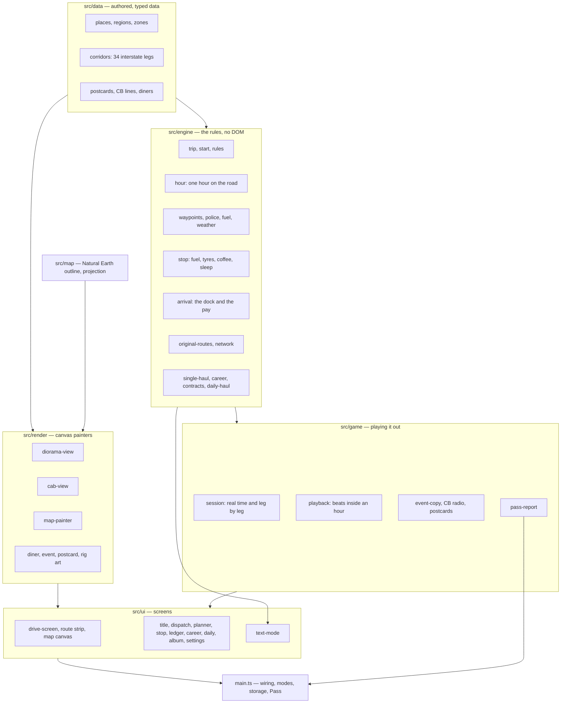
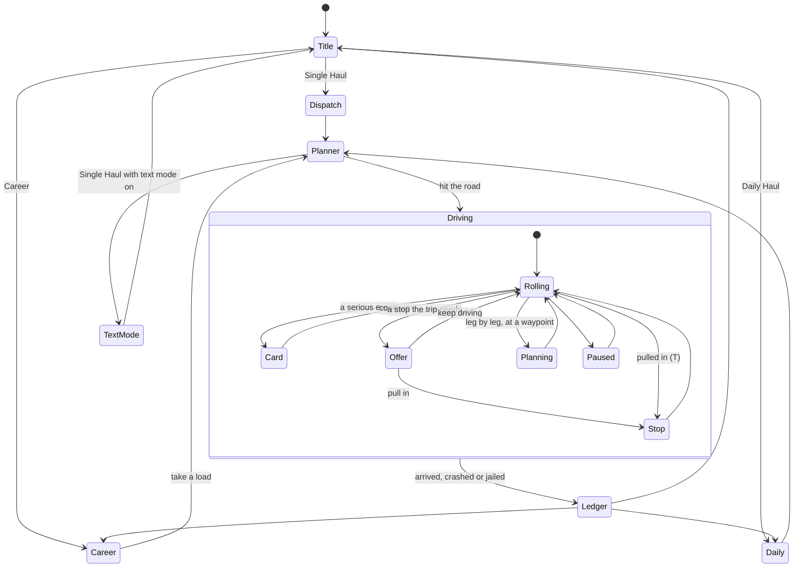

# Long Haul — architecture

Long Haul is an engine that plays one hour of a trip at a time, with three
front ends on top: real time, leg by leg, and the original's text mode. The engine
is plain TypeScript with no DOM, seeded, deterministic to the bit in every
browser, and covered by tests; everything you see and hear is drawn and
synthesized in code on top of it.

The decisions behind it: [map data source and licence](../../../docs/adr/0015-long-haul-map-data.md),
[the hour-tick engine and its front ends](../../../docs/adr/0016-long-haul-hour-engine.md),
[the corridor data model](../../../docs/adr/0017-long-haul-corridors.md).

## Module overview



The engine never imports from `game`, `render` or `ui`. `src/sim` (the
simulated drivers and the determinism trace) sits beside the engine and is
used by tests, scripts and the browser determinism check.

## Folder tree

```
ports/long-haul/
├── index.html                 the page; pre-paints the theme
├── favicon.svg                a green highway sign
├── pass.manifest.ts           Arcade Pass: 27 badges, 5 rig paints, 6 stats
├── playwright.config.ts       browser tests: smoke, phone, determinism, screens
├── README.md
├── docs/                      ABOUT, HOW-TO-PLAY, ARCHITECTURE
├── media/                     screenshots for the docs and the Hall
├── dev/art/                   a dev-only bench for the painters (?region=…&view=cab)
├── e2e/
│   ├── helpers.ts             fake clock, open the game, drive a trip to the end
│   ├── game.spec.ts           smoke tests, also run at phone size
│   ├── engine.determinism.ts  the engine bundled and compared with Node, per browser
│   ├── modes.screens.ts       every screen at four sizes, day and night
│   └── media.screens.ts       candidate pictures for media/
├── scripts/
│   ├── build-map.ts           Natural Earth → src/map/geography.ts
│   ├── balance.ts             thousands of Single Hauls per driver, route, cargo
│   ├── career-sim.ts          whole careers per driver
│   └── weather-mix.ts         how often each condition comes up
└── src/
    ├── main.ts                screens, modes, storage, sound, Pass, the loop
    ├── settings.ts            the settings and their sanitiser
    ├── theme.ts               follow the device, day or night
    ├── audio/sounds.ts        every sound effect and both songs, as synth patches
    ├── data/
    │   ├── places.ts          ~260 towns, sites and state lines; the 19 hubs
    │   ├── regions.ts         the 32 landscapes
    │   ├── zones.ts           time zones by state and by place
    │   ├── corridors.ts       34 interstate corridors, mile by mile
    │   ├── postcards.ts       a two-sentence note per place and state
    │   ├── cb-lines.ts        the CB regulars and their lines by topic
    │   ├── place-lines.ts     CB lines about particular places
    │   └── diners.ts          truck stop names, specials, pies and neon
    ├── engine/
    │   ├── original-data.ts   the original DATA tables, verbatim
    │   ├── original-routes.ts decoding the tables; corrections; the return trip
    │   ├── route.ts           routes, waypoints and their events
    │   ├── network.ts         corridors joined into routes; route options
    │   ├── rules.ts           every number of the rules, with its line
    │   ├── trip.ts            the trip's state and small helpers
    │   ├── start.ts           leaving the terminal
    │   ├── hour.ts            one hour: crash, blowout, patrol, fuel, miles, waypoints
    │   ├── waypoints.ts       tolls, work zones, radar, scales, rock slides, reefers
    │   ├── police.ts          the patrol threshold, tickets, radar readings
    │   ├── fuel.ts            running dry
    │   ├── weather.ts         the original weather draw
    │   ├── living-weather.ts  drifting weather systems for the network
    │   ├── conditions.ts      weather and fatigue states, the fatigue ladder
    │   ├── outlook.ts         looking ahead to the next hour; after a stop
    │   ├── stop.ts            a truck stop
    │   ├── arrival.ts         the dock, the pay, the settlement
    │   ├── clock.ts           days, hours and their names
    │   ├── cargo.ts           oranges, freight, mail
    │   ├── difficulty.ts      Easy, Normal, Hard
    │   ├── rig.ts             the rig's specification
    │   ├── streams.ts         named random streams
    │   ├── events.ts          everything that can happen on a trip
    │   ├── foresight.ts       what lies ahead, for the CB and the strip
    │   ├── position.ts        where along the route the rig is, in degrees
    │   ├── single-haul.ts     the original run and its verdict
    │   ├── contracts.ts       job boards and contract trips
    │   ├── career.ts          the career: money, name, garage, calendar
    │   └── daily-haul.ts      the day's load and the share line
    ├── sim/
    │   ├── drivers.ts         cautious, balanced and reckless drivers
    │   └── fingerprint.ts     the determinism trace
    ├── game/
    │   ├── session.ts         a trip in play: phases, beats, hooks
    │   ├── playback.ts        where each event falls inside its hour
    │   ├── event-copy.ts      the words for every event, original lines kept
    │   ├── cb-radio.ts        channel 19: chatter and tips
    │   ├── postcards.ts       the album
    │   ├── map-layers.ts      what the map shows during a trip
    │   └── pass-report.ts     a finished trip's XP, badges and stats
    ├── map/
    │   ├── geography.ts       generated: states and lakes as path data
    │   ├── projection.ts      Albers equal-area, degrees to map units
    │   └── route-geometry.ts  route lines, distances along them, bounds
    ├── render/
    │   ├── colour.ts          colours and lighting
    │   ├── sun.ts, sky.ts     the sun's altitude by place and time; skies
    │   ├── horizon.ts         far layers: mountains, mesas, skylines
    │   ├── landscapes.ts      the 32 landscapes as layers and kinds
    │   ├── scenery.ts         ~40 painters: trees, barns, billboards, cattle…
    │   ├── landmarks.ts       signs and structures at waypoints
    │   ├── rig.ts             the rig, side on, and its paints
    │   ├── diorama-view.ts    the side view
    │   ├── cab-view.ts        the view from the cab and the dashboard
    │   ├── weather-fx.ts      rain, snow, fog, the edges of fatigue
    │   ├── map-painter.ts     the map: states, roads, trail, weather, night
    │   ├── stage.ts           the drive canvas and its glow
    │   ├── scene.ts           what a frame of the road needs to know
    │   ├── event-art.ts       pictures for the event cards
    │   ├── diner-art.ts       the truck stop scene
    │   └── postcard-art.ts    large-letter postcards
    ├── ui/                    one file per screen, plus dom, format, icons,
    │                          the route strip, the map canvas and menu navigation
    └── styles/                base tokens, the screens, the drive screen
```

## The loop and the state machine

`main.ts` runs one `createLoop` that renders whatever screen is showing; the
session advances inside the drive screen's frame. A trip's life:



Inside the drive screen, `TripSession` (`game/session.ts`) owns the phases
`rolling`, `card`, `offer`, `stop`, `planning`, `paused` and `done`. When an
hour starts it calls `driveHour`, which settles the whole hour at once, then
`planHour` (`game/playback.ts`) places each event at its moment inside the
hour: a waypoint at its milepost, a blowout somewhere along the way. The
session plays the hour out over about three seconds (real time) or 0.6 s
(leg by leg), pausing at cards. The hook functions (`SessionHooks`) are how
the screen hears about cards, waypoints, stop offers and the end.

Each hour also lays out its landmarks (`landmarksFor`): a guide sign before
each town, a state-line welcome, the toll plaza or scale at its moment, and
the truck stop's pole near the end of an hour that offers one. Each carries
the scroll position at which it is level with the cab. An hour often ends
right at a sign, so a new hour keeps the old hour's landmarks until they are
4,000 px of road behind (`LANDMARK_TRAIL`): the pole of a stop passed up
slides off behind the trailer instead of vanishing.

The text mode does not use the session: it calls the same engine functions
directly, an hour per answer, as the original did.

## Engine rules and formulas

All in `src/engine`, with the original's line numbers in the comments; the
full account of the original is in
[the behaviour notes](../../../docs/games/long-haul.md).

| Rule | Where | Formula |
|---|---|---|
| Crash | `hour.ts` | `speed² × fatigueRisk × weatherRisk > RND × 10⁷` |
| Blowout | `hour.ts` | `(miles + 100) × wear² > (RH × 25000 × RND)²` (the original's square root, squared away) |
| Patrol threshold | `police.ts` | `limit − RH + 10` (minus 2 on Hard) |
| Ticket | `police.ts` | none while `(speed − limit + 2·RH − 5)² < 900 × RND` |
| Fine | `police.ts` | `5 × (RT + offences × RND × 4)` dollars `+ offences × RND × 5` per mph over |
| Fuel | `rules.ts` | mpg `4.5 − 0.2 × min(|55 − speed|, 12.5)` |
| Speed cap | `rules.ts` | `floor(1.5 × limit)` |
| Weather (original routes) | `weather.ts` | `(3000 + miles) × RND` against per-route thresholds |
| Fatigue | `conditions.ts` | ladder on hours awake and hours/sleep (the cosine fixed) |
| Scale | `waypoints.ts` | `19000 + load + 7 × gallons + 25 × INT(RND × 10)` against 60,000 |
| Pay | `arrival.ts` | rate × pounds; oranges −5 % a point of damage; freight −10 % late |
| Truck | `arrival.ts` | `$85 × (days + 1)` |

**Determinism.** The engine uses only `+ − × ÷`, `Math.floor`/`round`/`abs`/
`min`/`max` and integers; no `Math.sin`, `Math.pow`, `Math.random` or `**`
(a test greps the engine for them). Every random draw comes from a stream
named after its moment (`streams.ts`: the n-th hour, the scale at Gallup,
the second truck stop), so two drivers on the same seed meet the same luck
at the same moment whatever they did before. The browser test bundles
`sim/fingerprint.ts` and compares 450 lines of results with Node's, bit for
bit.

**Living weather** (`living-weather.ts`): a season's systems are seeded per
trip from nurseries (Rockies, northern plains, Gulf, Appalachians…), each an
ellipse with a centre, a drift and a life; the condition at a point and hour
is the strongest system there, mapped onto the original six conditions.

**The network** (`network.ts`): corridors are typed tables of
`[mile, place, road, codes]` rows in `data/corridors.ts`; `routeOptions`
finds simple paths between hubs (no hub twice, at most 1.35 × the shortest)
and `joinLegs` turns a path into a `Route` with time zones and state lines
filled in.

## Rendering pipeline

The drive screen has one canvas (`render/stage.ts`) drawn every frame from a
`DriveScene` (`render/scene.ts`) that the session builds: where along the
road, which landscape (and the one being left), the sun's altitude for that
place and moment (`sun.ts`, from the real date and longitude), the weather,
fatigue, the rig's paint and cargo, landmarks coming up, the dashboard
readings.

- **Side view** (`diorama-view.ts`): sky (`sky.ts`: gradient, sun, moon,
  stars, clouds) → far layers (`horizon.ts`: mountains, mesas, buttes,
  ridges, skylines, with haze and snowcaps) → ground → three bands of
  scenery tiles (`scenery.ts` painters chosen by `landscapes.ts`) → landmarks
  behind the road → the road → near things → the rig (`rig.ts`) → landmarks
  in front → foreground → precipitation and fatigue (`weather-fx.ts`).
- **Cab view** (`cab-view.ts`): the same sky and far layers, then a
  perspective road with roadside posts, signs and traffic, headlight beams,
  rain, frost and wipers on the glass, the frame and mirrors, and the
  dashboard: speedometer with odometer, fuel gauge, clock, CB set, limit
  placard, radar detector and the folded atlas, which the drive screen
  paints into an offscreen canvas with `map-painter.ts` and the cab view
  draws, folded and clipped, onto the dash.
- **Map** (`map-painter.ts`): the state outlines and lakes from
  `map/geography.ts`, the corridor network, routes, the trail coloured by
  speed, markers, towns, weather systems, time-zone bands and the night side
  (a low-resolution mask, cached). Three palettes: paper, night, and the
  atlas on the dash.
- **Glow**: `stage.ts` runs the shared post-effects (bloom, vignette) over
  the drive canvas, stronger at night.

## Where every visual "asset" lives

There are no image files except the favicon; everything is drawn.

| Thing | Code |
|---|---|
| The rig, its paints and liveries | `render/rig.ts` (`RIG_PAINTS`, `paintRigSide`; one function per part, see below) |
| The 32 landscapes | `render/landscapes.ts` (colours, far layers, scenery mix) |
| Trees, cacti, barns, silos, derricks, billboards, cattle… | `render/scenery.ts` (`PAINTERS`) |
| Mountains, mesas, skylines | `render/horizon.ts` |
| Sky colours, sun, moon, stars, clouds | `render/sky.ts`, `render/sun.ts` |
| Highway signs, tolls, scales, tunnels, the truck stop pole | `render/landmarks.ts` |
| Rain, snow, fog, fatigue | `render/weather-fx.ts` |
| The cab and dashboard | `render/cab-view.ts` |
| The map and its palettes | `render/map-painter.ts` (`MAP_PALETTES`) |
| Event card pictures | `render/event-art.ts` |
| The diner | `render/diner-art.ts` |
| Postcards | `render/postcard-art.ts` |
| The US outline | `map/geography.ts`, generated by `scripts/build-map.ts` from Natural Earth |
| The Hall cover | `hall/covers/long-haul.ts` |
| UI colours and type | `src/styles/base.css` (tokens for day and night) |
| Icons | `src/ui/icons.ts` (inline SVG paths) |
| Sound effects and music | `src/audio/sounds.ts` (synth patches for `@shared/audio`) |

**The rig** is laid out on a grid of 100 units from the trailer's back door
to the bumper, wheels on the road at 0, and scaled to whatever length the
caller asks for (the side view, the diner's pump, the parked rigs at the
back of the lot). It keeps the proportions of an early-eighties long-nose
conventional: the cab roof well under the trailer's and a long, low hood
over a swept steer fender. `paintRigSide` draws what sits behind
the tyres (frame rails, fifth wheel, wheel well, mud flaps), the wheels,
then the trailer and `paintTractor`, which paints the tractor back to front,
one function per part: air lines, sleeper, cab and hood, the swept fender,
the paint stripe, the door with its window and driver, the saddle tank and
steps, the air cleaner, the stack, the mirror and CB whip, the visor lamps
and air horns, and the nose (grille, headlamp, bumper). Three gradient
helpers give it its finish: `paintedPanel` (a sky highlight over the paint
and shade underneath), `chrome` and `chromePipe` (polished metal on flat and
upright parts), plus `glass` for the windows. Every colour goes through
`lit()`, so the rig darkens and warms with the time of day like the
scenery. A parked rig has its headlights off, no one at the wheel, a still
antenna and, at night, a lit bunk window.

## How settings flow

`settings.ts` defines the settings and sanitises whatever is in storage
(`neoarcade:long-haul:settings`); `main.ts` holds the current copy and hands
`() => settings` to every screen that needs it, so a change takes effect at
once. The session reads the rhythm, warp and event pause each frame; the
drive screen reads the view and units; the difficulty is copied into a trip
when it starts and stays with it. The theme lives in `theme.ts`, the sound
mix in the arcade-wide `@shared/audio` store. Other saved state:
`single-record` and `single-last` (Single Haul), `career`, `daily` (via
`shared/daily`), `postcards`, `cb-record` (how often each CB regular was
right).

## Tests

- **Engine** (`npm test`): `original.test.ts` checks the original tables, the
  corrections and the original formulas; `hour.test.ts` and `stop.test.ts`
  the hour and the stop; `network.test.ts` that every corridor is plausible
  against straight-line distance, connected, and that routes join with the
  right time zones; `career.test.ts`, `daily.test.ts`; `determinism.test.ts`
  replays seeded trips and greps the engine for forbidden maths;
  `data/data.test.ts` checks the authored data; `game/pass-report.test.ts`
  the badges.
- **Browser** (`npx playwright test -c ports/long-haul …`): `smoke` and
  `phone` play every mode from the production build; `determinism-*` runs
  the engine in Chromium, Firefox and WebKit against Node; `screens` renders
  every screen at four sizes in both themes for art direction.
- **Balance**: `scripts/balance.ts` and `scripts/career-sim.ts` (results in
  the behaviour notes).

## How to extend

- **A new place**: add it to `data/places.ts` (with its region and kind), a
  note in `data/postcards.ts`; the data test will ask for the note.
- **A new corridor**: add a table to `data/corridors.ts` (rows of mile,
  place, road and event codes). `network.test.ts` checks its mileage against
  the map and that the network stays connected.
- **A new hub**: add its id to `HUB_IDS` and its refrigerated goods to
  `REEFER_GOODS` in `engine/contracts.ts`.
- **A new landscape**: a `RegionId` in `data/regions.ts`, a `Landscape` in
  `render/landscapes.ts`, and new painters in `render/scenery.ts` if needed.
- **A new event**: a `WaypointEvent` kind in `engine/route.ts`, its handling
  in `engine/waypoints.ts`, a `TripEvent` in `engine/events.ts`, its words in
  `game/event-copy.ts` and a picture in `render/event-art.ts`.
- **A new upgrade**: `UPGRADES` and `rigWith` in `engine/career.ts`.
- **A new badge**: the manifest, then a rule in `game/pass-report.ts` (with a
  test), or a call in `main.ts` for career and daily badges.

## Arcade Pass

`main.ts` calls `connectPass(manifest)` once and mounts the unlock toasts
(`mountUnlockToasts`, accent `#2fbf71`, through the game's audio). Toasts are
**held** while a trip is on the road (drive, stop and text screens) and
**flushed** on every other screen, so a badge never covers the road; Esc or a
pad's B dismisses one before going back.

- **XP** (`game/pass-report.ts`): 10 for a trip that ends on the road; for a
  delivery, 30 plus up to 20 for distance, 15 more for "good work" (over $100
  profit) and 5 for on time and unspoiled. Practice runs of the Daily Haul
  earn half.
- **Badges from a finished trip** (`findings` in `pass-report.ts`): First Load,
  Coast to Coast, Westbound, Holland Tunnel, Fresh Squeezed, Neither Snow nor
  Rain, G O O D W O R K, Right on Time (counted), Clean Run, Early Bird,
  Blizzard Survivor, Daily Driver, Bottomless Cup and Smokey's Best Friend
  (counted), Iron Bladder (600 miles between stops), Night Owl (every hour
  from midnight to 5 AM on the move), Rock Slide Napper, and the secrets
  DUMMY !!, Washing Dishes, Repossessed and Sound Asleep.
- **Elsewhere in `main.ts`**: Postcard Collector (the album's count, on every
  new card), A Week on the Road (a seven-day daily streak), and the career
  badges Fully Loaded, Legend of the Docks, Fat Wallet and Million-Mile Club
  (checked after every load and purchase); Repossessed also when waiting a
  day empties the bank.
- **Stats**: trips, loads delivered, miles, best trip (dollars), postcards,
  tickets.
- **Cosmetics**: five rig paints, unlocked by level 3 or by a badge; the
  settings screen checks `pass.isUnlocked` and the rig falls back to classic
  red if a chosen paint is locked. They change nothing but the colours.
