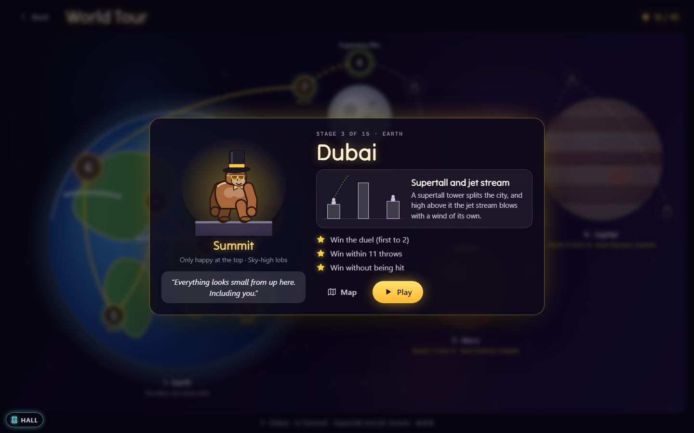

# About Skyline Showdown

*Inspired by QBasic Gorillas, © Microsoft Corporation 1990.*

The sun is going down over the city. Somewhere up there, on two rooftops at
opposite ends of the skyline, two gorillas are sizing each other up. Each
has a pile of bananas, and the bananas explode.

## The original

| | |
|---|---|
| **Title** | QBasic Gorillas (`GORILLA.BAS`) |
| **By** | Microsoft Corporation |
| **Year** | 1990 (copyright line in the source) |
| **Language** | QBasic |
| **Platform** | MS-DOS PCs with CGA, EGA or VGA graphics |
| **Where it appeared** | A sample program included with QBasic, which shipped with MS-DOS 5.0 |

Gorillas came free with the operating system, and that is how an entire
generation met it. Anyone who opened QBasic could press Shift+F5 and play.
Anyone curious enough could scroll through the source and see how a game
was made. It was two players at one keyboard, taking turns typing an angle
and a velocity, then watching a banana arc across a blocky EGA skyline:
wind arrow at the bottom, a smiling sun at the top.

People remember the small things. The sun's shocked "O" when a banana flew
through it. The chunk bitten out of a building by every miss. The groan of
a velocity typed one digit too high, and the triumph of the throw that
finally landed, followed by the victory dance. It rewarded patience, a bit
of physics intuition, and not hitting yourself.

## This version

Skyline Showdown keeps the heart of Gorillas and rebuilds everything
around it.

**What stays the same**

- The physics, step for step: angle and velocity, the same gravity and
  wind formula, the same 640 × 350 playfield. A throw that worked in 1990
  flies the same way here.
- The cities: buildings rising, falling or peaking across the screen, a
  quarter of the windows dark, gorillas on the second or third roof from
  each edge.
- Permanent holes in the skyline, the sun you can hit (it doesn't mind),
  bananas that sail over the top of the screen and come back down.
- Typing your numbers, with the **Classic 1990** preset: two players, one
  keyboard.

### A World Tour, with rivals

Pack a bag of bananas and go round the world, then off it. Fifteen stops
in four chapters: six cities on Earth, then the Moon, Mars and Jupiter.
Every stop bends the rules a little, and you meet each twist on its own
before the bosses start mixing them.

- **Jakarta**, where the monsoon changes the wind after every throw.
- **Tokyo**, where a neon billboard drone patrols the sky and swallows
  bananas. It only moves while one is flying: learn its timing.
- **Dubai**, with a supertall tower in the way and a jet stream roaring
  over the top of it.
- **Cairo**, where the heat haze hides the wind gauge. Read the flags and
  the smoke.
- **Rio**, a city stacked up a hillside: one of you throws uphill.
- **New York**, the Earth boss, where the drone is back and the wind won't
  sit still.

Then the Moon's springy ground and slow, floaty arcs; Mars's dust devils
and dust storms; and Jupiter's crushing gravity, storms and lightning that
marks a rooftop one throw ahead, then blasts it.

Waiting at every stop is a **rival**, and they are characters. Drizzle is
a cheerful rookie in a knitted beanie who throws high and learns slowly.
Glitch runs on energy drinks and throws flat and fast. Tempo never stops
moving and overcorrects wildly. The Landlord owns every roof in New York,
starts sharp and gets rattled when you land one. Orbit has all the time in
the world. Rust has grit in every throw. And at the end of it all, in the
eye of the storm, Colossus waits: Brutal, and only nerves can crack it.
Each has a look built from the wardrobe, a colour of their own, and
something to say when you miss by a whisker or finally land a hit. Beat
one and they'll take you on again any time in Quick Match.

Win a stage for a star. Win it within its throw budget for a second, and
without being hit for a third. Stars open the road to the next world, so a
sharp shot moves fast, but anyone can get there by coming back for a few
more.

### "So close!"

Every miss tells you how close it came: a pin where the banana landed, the
distance in metres (a gorilla is about two metres tall), short, long or
over, and a word of encouragement that never repeats itself. It's the
friend on the sofa saying "just a bit harder".

### A wardrobe, and badges

Sixty things to wear and throw: fur tints, caps, top hats, a space helmet
and a crown, shades and 3D glasses, scarves and capes, banana skins from
fire to chrome to pixel, trails of hearts or rainbows, explosions of
confetti or fireworks, and victory dances from the robot to the chest
thump. Player 1 and player 2 each dress their own gorilla. Stars, badges
and your Arcade Pass level unlock the rest. None of it changes a thing
about how a banana flies. A hat is a hat.

Twenty-eight badges wait on your **Arcade Pass**, the profile you carry
across every NeoArcade game: Sunburn, Moonshot, Demolition, Rival
Collector, Three-Star General, and a few secret ones we won't spoil (one
involves a drone and a very generous player).

### Everything else that's new

- A city that breathes: layered skylines, windows that switch on and off,
  smoke, flags and rain that show you the wind, dusk turning to night and
  dawn. On the tour, each city is built from its own kit of facades,
  rooftops and horizon.
- Gorillas with personality. They breathe, wind up, face-palm after a bad
  miss, taunt, panic when a banana whistles past, and dance when they win.
- **Four worlds**: Earth, the Moon (with Earth smiling in its sky), Mars and
  Jupiter, each with its own gravity.
- **A CPU opponent** at four levels, which learns from its own misses the
  way you do.
- **Power-ups** on balloons in Quick Match: the Golden Banana, the
  Tri-Banana, Calm Air, the Bouncer and the Rooftop Shield.
- **Slingshot aiming** by mouse or touch, plus keyboard and gamepad, and an
  optional **Aim assist** that sketches the first third of your throw.
- **Instant replays** of every knockout, in slow motion.
- **Light or dark**, as you like.
- A few old bugs fixed. Hitting yourself now scores for your opponent, as
  it was always meant to.

## Why play it today

Because it is still one of the best "one more throw" games ever written,
and now it has somewhere to go. Take the tour on your own an evening at a
time, dress your gorilla in what you've earned, then drag a friend to the
sofa for a Quick Match against each other, or against the rival who gave
you the most trouble.

