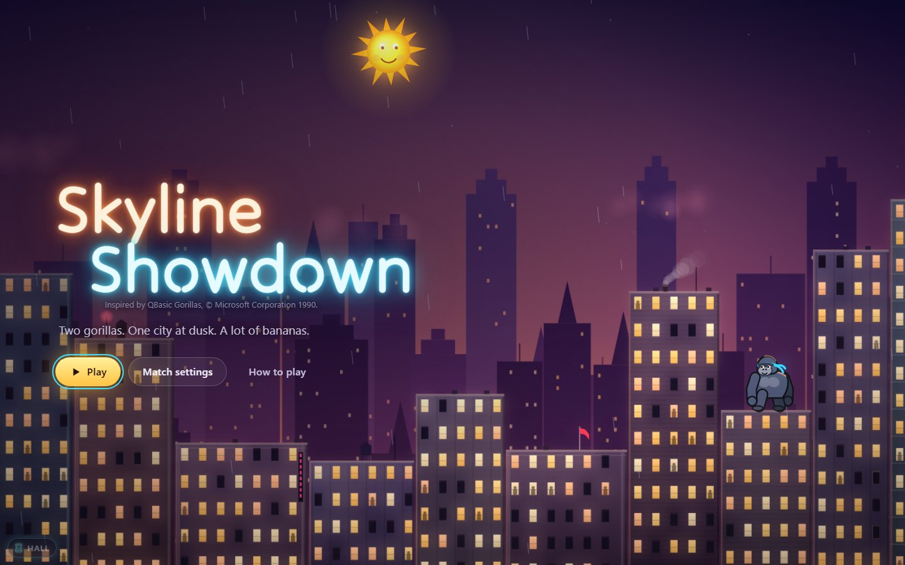
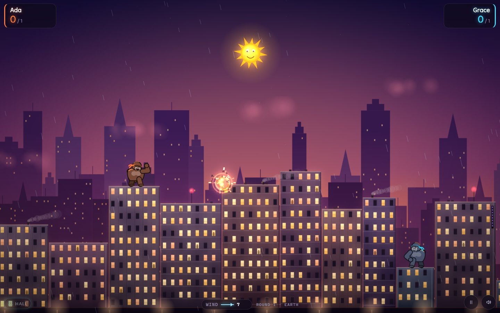
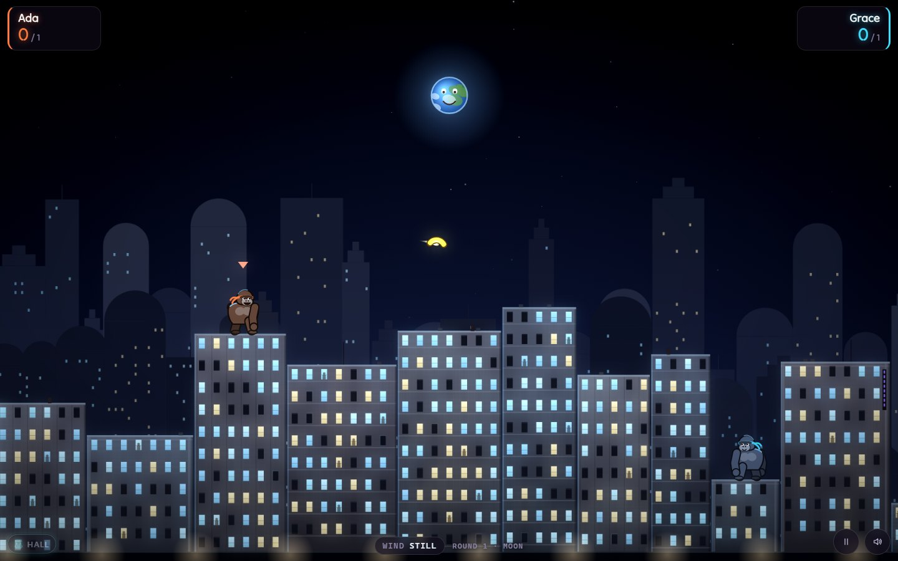

# About Skyline Showdown

*Inspired by QBasic Gorillas, © Microsoft Corporation 1990.*

The sun is going down over the city. Somewhere up there, on two rooftops at
opposite ends of the skyline, two gorillas are sizing each other up. Each
has a pile of bananas, and the bananas explode.

## The original

| | |
|---|---|
| **Title** | QBasic Gorillas (`GORILLA.BAS`) |
| **By** | Microsoft Corporation |
| **Year** | 1990 (copyright line in the source) |
| **Language** | QBasic |
| **Platform** | MS-DOS PCs with CGA, EGA or VGA graphics |
| **Where it appeared** | A sample program included with QBasic, which shipped with MS-DOS 5.0 |

Gorillas came free with the operating system, and that is how an entire
generation met it. Anyone who opened QBasic could press Shift+F5 and play.
Anyone curious enough could scroll through the source and see how a game
was made. It was two players at one keyboard, taking turns typing an angle
and a velocity, then watching a banana arc across a blocky EGA skyline:
wind arrow at the bottom, a smiling sun at the top.

People remember the small things. The sun's shocked "O" when a banana flew
through it. The chunk bitten out of a building by every miss. The groan of
a velocity typed one digit too high, and the triumph of the throw that
finally landed, followed by the victory dance. It rewarded patience, a bit
of physics intuition, and not hitting yourself.

## This version

Skyline Showdown keeps the heart of Gorillas and rebuilds everything
around it.

**What stays the same**

- The physics, step for step: angle and velocity, the same gravity and
  wind formula, the same 640 × 350 playfield. A throw that worked in 1990
  flies the same way here.
- The cities: buildings rising, falling or peaking across the screen, a
  quarter of the windows dark, gorillas on the second or third roof from
  each edge.
- Permanent holes in the skyline, the sun you can hit (it doesn't mind),
  bananas that sail over the top of the screen and come back down.
- Typing your numbers, with the **Classic 1990** preset: two players, one
  keyboard.

**What is new**

- A city that breathes: layered skylines, windows that switch on and off,
  smoke, flags and rain that show you the wind, dusk turning to night and
  dawn.
- Gorillas with personality. They breathe, wind up, face-palm after a bad
  miss, taunt, panic when a banana whistles past, and dance when they win.
- **Four worlds**: Earth, the Moon (with Earth smiling in its sky), Mars and
  Jupiter, each with its own gravity.
- **A CPU opponent** at four levels, which learns from its own misses the
  way you do.
- **Power-ups** on balloons drifting over the city: the Golden Banana, the
  Tri-Banana, Calm Air, the Bouncer and the Rooftop Shield.
- **Slingshot aiming** by mouse or touch, plus keyboard and gamepad, and an
  optional **Aim assist** that sketches the first third of your throw while
  you learn the feel of it.
- **Instant replays** of every knockout, in slow motion.
- A few old bugs fixed. Hitting yourself now scores for your opponent, as
  it was always meant to.

## Why play it today

Because it is still one of the best "one more throw" games ever written,
and it is even better with a friend on the sofa. Start on the Moon for
floaty lobs, go to Jupiter when you want bananas that fall like bricks, or
set the Classic preset and relive 1990 with better lighting.

