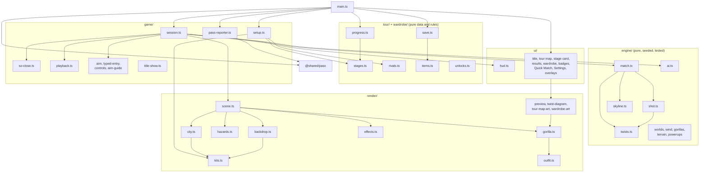
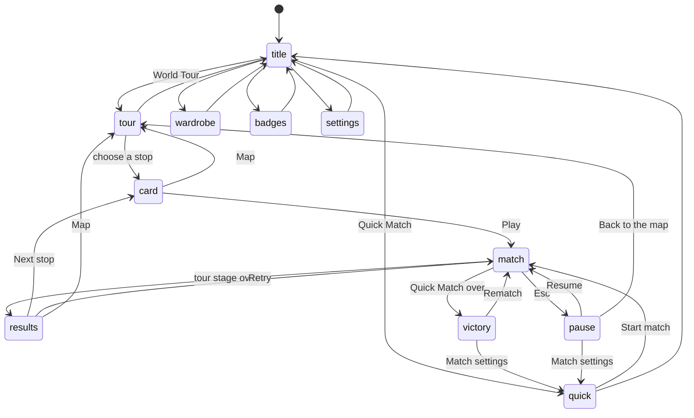
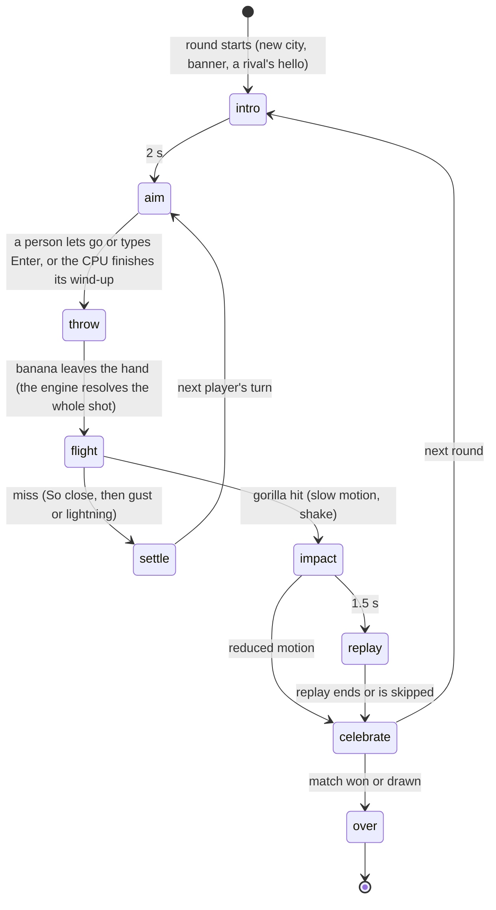
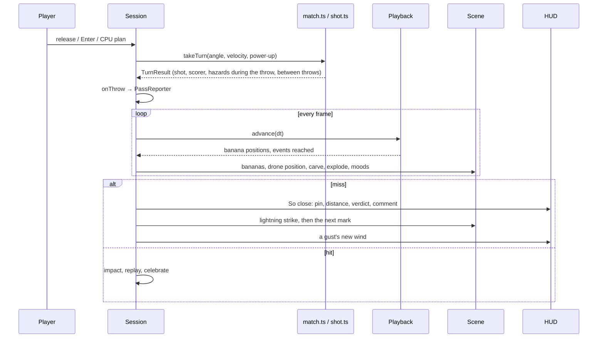
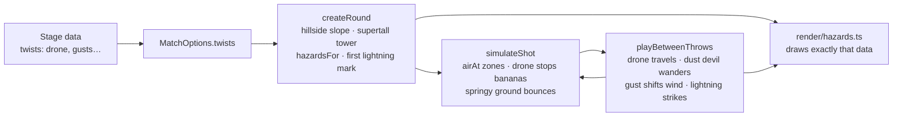
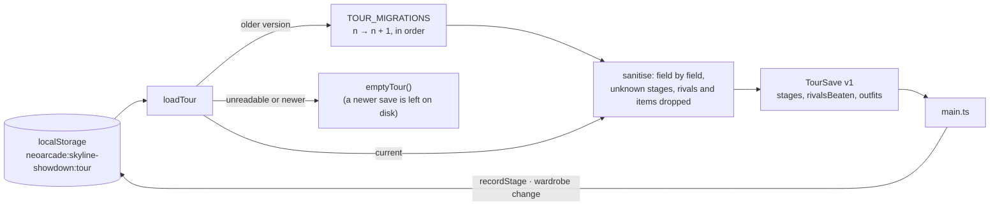
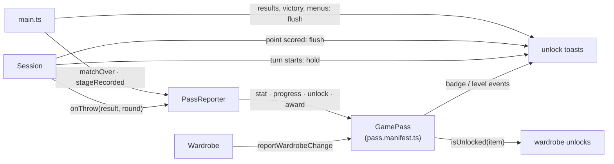
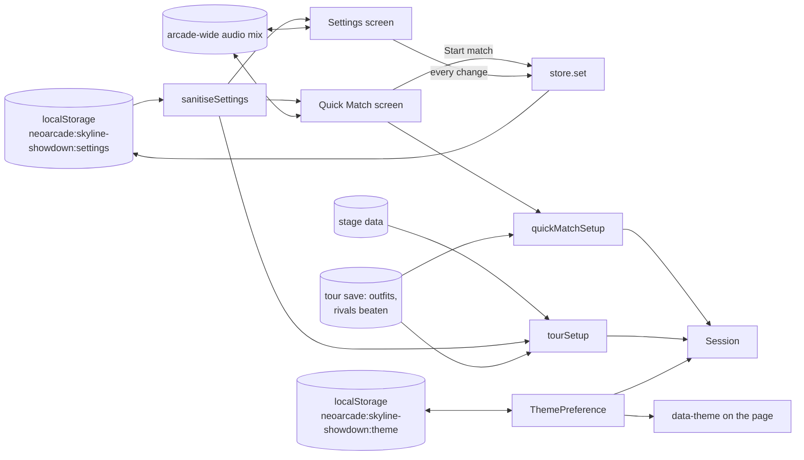

# Skyline Showdown — architecture

The game has three layers. A pure **engine** decides everything and never
touches the DOM. A **game** layer runs turns, input, the CPU and playback,
and the World Tour's rules of progress live beside it in **tour/** and
**wardrobe/**. The **render** and **ui** layers make it visible and
audible. Shared pieces (`@shared/*`) handle input, audio, the loop,
randomness, storage, post-processing and the Arcade Pass.

## Module overview



## Folder tree

```
ports/skyline-showdown/
├── index.html              page shell; the game mounts into #game
├── favicon.svg             code-drawn icon
├── pass.manifest.ts        badges, Pass-unlocked cosmetics and stats for the Arcade Pass
├── playwright.config.ts    browser tests for this port (smoke, screens, playtest)
├── README.md
├── docs/                   ABOUT, HOW-TO-PLAY, this file
├── media/                  screenshots used by the docs and the Hall
├── e2e/
│   ├── helpers.ts          fake-clock stepping, mirrored matches, throw search
│   ├── game.spec.ts        smoke: title, throws vs CPU, pause, typed win, balloon, settings, theme
│   ├── tour.spec.ts        smoke: map and card, a flawless Jakarta win, So close, wardrobe, badges, rivals in Quick Match
│   ├── art.screens.ts      screenshots of every state, world, city and viewport
│   ├── cpu.playtest.ts     full matches against every CPU level, checked against the rules
│   └── tour.playtest.ts    the whole World Tour played by a stand-in player, checked against the rules
├── test/
│   ├── fixtures.ts         hand-built cities for engine tests
│   └── tour-sim.ts         the stand-in "decent human" and the pacing model for tuning
└── src/
    ├── main.ts             wiring: screens, sessions, saves, the Pass, the loop
    ├── settings.ts         settings, presets, validation, match options
    ├── theme.ts            light, dark or auto: stored, resolved, followed live
    ├── styles.css          HUD, menus and screens, as colour tokens for both themes
    ├── engine/
    │   ├── constants.ts    world size, step time, radii, the sun
    │   ├── worlds.ts       gravity and wind scale per world
    │   ├── skyline.ts      the city: slope patterns (and the tour's hillsides), windows
    │   ├── wind.ts         the original's wind roll
    │   ├── gorillas.ts     placement, hitboxes, throwing hand
    │   ├── terrain.ts      buildings minus craters and cuts; collision
    │   ├── powerups.ts     kinds, balloons and their drift
    │   ├── twists.ts       the World Tour's stage modifiers
    │   ├── shot.ts         the throw simulation: segments, zones, collisions, events
    │   ├── match.ts        rounds, turns, scoring, twists between throws
    │   └── ai.ts           the CPU opponent: levels and play styles
    ├── game/
    │   ├── session.ts      one match: phases, people, CPU, reactions, So close, replay
    │   ├── setup.ts        a Quick Match or a tour stage as players, rules and scenery
    │   ├── so-close.ts     how close a miss came, and what to say about it
    │   ├── pass-reporter.ts  what the Arcade Pass hears: stats, badges, XP
    │   ├── playback.ts     plays a finished shot back in time
    │   ├── aim.ts, human-aim.ts, typed-entry.ts, controls.ts, aim-guide.ts
    │   ├── reactions.ts    what the city does at each shot event
    │   └── title-show.ts   the title screen's establishing shot
    ├── tour/
    │   ├── stages.ts       four chapters, fifteen stages: data
    │   ├── rivals.ts       ten rivals: level, style, outfit, colour, lines
    │   ├── progress.ts     stars, unlocks, recording a result
    │   └── save.ts         the tour save, versioned with migrations
    ├── wardrobe/
    │   ├── items.ts        sixty items in eight slots, outfits
    │   └── unlocks.ts      what can be worn right now
    ├── render/
    │   ├── stage.ts        canvas, resize, post-processing
    │   ├── camera.ts       fit, follow, push-in, shake
    │   ├── scene.ts        one round's visuals in draw order
    │   ├── kits.ts         each city's kit: facades, tints, rooftops, silhouettes, horizon
    │   ├── city.ts         offscreen facades, windows, rooftops, carving
    │   ├── rooftop-props.ts  tanks, dishes, billboards, domes, solar panels, rods, gardens
    │   ├── backdrop.ts     sky, stars, parallax skylines and horizons, street
    │   ├── atmosphere.ts   clouds, smoke, flags, rain, fog, lightning
    │   ├── hazards.ts      the drone, jet stream, dust devil, lightning, springy roofs, heat haze
    │   ├── sky-body.ts     the mascot: Sun, Moon, Earth, Phobos, Io
    │   ├── gorilla.ts      vector gorillas, moods, dances, looks
    │   ├── outfit.ts       hats, glasses, neckwear, banana skins, trails
    │   ├── effects.ts      fire, sparks, debris, smoke, embers, explosion styles
    │   ├── palette.ts      colours per world, time of day and theme
    │   ├── preview.ts      a gorilla on its own rooftop, for the menus
    │   ├── twist-diagram.ts  the stage card's little animated diagrams
    │   ├── tour-map-art.ts the World Tour map
    │   └── wardrobe-art.ts item thumbnails and silhouettes
    ├── ui/
    │   ├── hud.ts          plates, wind, twist, throws, aim, typed panel, speech, So close
    │   ├── title-screen.ts the main menu
    │   ├── tour-map.ts, stage-card.ts, results-screen.ts
    │   ├── wardrobe-screen.ts, badges-screen.ts
    │   ├── settings-screen.ts  Quick Match
    │   ├── preferences-screen.ts  Settings
    │   ├── overlays.ts     pause, victory, rotate hint
    │   ├── form.ts         segmented choices, toggles, sliders
    │   ├── menu-nav.ts     gamepad and arrow keys in menus
    │   ├── dom.ts, icons.ts
    └── audio/sounds.ts     every sound patch and song
```

## Screens



`main.ts` owns the screens. The title city keeps playing behind every menu
except the map, which covers the page, so the city rests while it is open.

## The loop and the match state machine

`main.ts` runs `@shared/loop` at a fixed 60 steps a second. Each step
updates the menus and either the current `Session`, or the title show and
whichever animated screen is open (map, stage card, wardrobe preview). Each
display frame renders the stage once.



The whole throw is simulated the moment the banana leaves the hand
(`takeTurn` → `simulateShot`). The `ShotRecord` holds every banana's path
and every event, each stamped with its step. `ShotPlayback` walks that
record at `STEPS_PER_SECOND` and hands events to `reactTo`, which triggers
effects, sounds, carving and moods. Nothing on screen can change the
outcome. The instant replay plays the last 2.5 seconds of flight before the
hit (all of it for a short throw), so a slow lunar arc doesn't take half a
minute to replay.



## Engine rules and formulas

- **World:** 640 × 350 units, y down, street at y = 335 (`constants.ts`).
- **Throw:** degrees measured from the thrower's side, mirrored for player 2
  (`worldAngle`). Velocity is rounded to a whole number, both clamped to
  0–360.
- **Flight:** each banana is a chain of ballistic segments. Within a
  segment, `x = x₀ + vx·τ + ½·p·τ²` and `y = y₀ + vy·τ + ½·g·τ²`, where
  τ = (step − segment start) × 0.1 and `p` is the sideways push: the wind
  over 5, or the air of a zone the banana is in (below). A bounce, a split,
  or crossing into or out of a zone starts a new segment from the current
  position and velocity, so paths stay continuous and exactly repeatable.
- **Checks per step:** off the sides (x ≤ 6 or x ≥ 634) or into the street
  (y ≥ 339) ends the throw as a miss. Above the top edge nothing is
  checked. Otherwise the path is walked in 2-unit hops, checking in order:
  sun (pass through, once), balloon (pass through, collect), the drone,
  each gorilla's three hitboxes, then terrain.
- **Terrain:** solid = inside a building rectangle and outside every crater
  and cut (ADR 0003).
- **Explosion:** crater radius 7, or 14 for a Golden Banana. A golden blast
  that reaches the roof removes the roof section above it (±1.6 × radius
  wide), and hits any gorilla standing there or inside the blast.
- **Gorilla hit:** a 16-unit crater at its centre; the thrower scores, or
  the opponent does on a self-hit.
- **Fumble:** velocity below 2 drops the banana onto the thrower.
- **Balloon:** drifts `wind × 0.06` units per step (±0.12 when calm), only
  while a banana is in the air. A 30 % chance per turn when none is out.
- **Match:** `firstTo` ends at N; `total` ends when the scores add up to N,
  and a draw is possible. Turns alternate forever. Each round draws from its
  own seeded generator, so a city never depends on earlier throws.

## The stage-modifier model

A World Tour stage is data (`tour/stages.ts`): a city, its world, its kit,
a list of **twists**, a rival, points, a throw budget and a light. The
engine interprets the twists (`engine/twists.ts`) at four fixed points of a
match; nothing else in the game knows how a twist works. The reasons are in
[ADR 0007](../../../docs/adr/0007-stage-modifiers.md).



| Twist | Rule |
|---|---|
| `gusts` | After every throw that doesn't end the round, the wind shifts by 2–5 notches either way (× the world's wind scale), staying within the rolled range. |
| `drone` | A 26 × 11 body on a rail between the gorillas (45 units clear of each), flying 16 units clear of the roofs beneath it wherever that fits below y = 48. It moves back and forth only while a banana flies (1/140 of its round trip per step, triangle wave), and carries on from there next throw. A banana touching it stops, without harming the city. |
| `supertall` | The building nearest the middle rises to 48–56 units from the top. |
| `jetStream` | A band from y 28 to 72 with its own wind of 11–15 (× the world's wind scale, at least half), either way, which replaces the ground wind inside it. |
| `hiddenWind` | Physics unchanged; the HUD hides the gauge and the CPU reads 40 % of the wind. |
| `hillside` | A steep slope, rising or falling (24 units a building), so the gorillas stand far apart in height. |
| `bouncy` | Every banana bounces once off the first building it hits (on top of a Bouncer's bounce). |
| `dustDevil` | A column 34 wide from the street up to y 70 that adds a push of 2.6–3.4 either way inside it. It wanders up to 36 units between throws, staying between the gorillas. |
| `lightning` | A roof is marked a throw ahead, never a gorilla's or one next to it. After a throw that doesn't end the round it's struck, leaving an 18-unit bowl, and the next roof is marked. |

Everything is rolled from the round's generator *after* what a twist-less
round rolls, so Quick Match cities (and old `?seed=` links) are unchanged.

## Rival styles

A rival is a CPU level plus a play style (`engine/ai.ts`, [ADR 0008](../../../docs/adr/0008-rival-styles.md)).
The style shifts how the level plays: a favourite angle and its spread, a
correction multiplier (over 1 overshoots and swings back), a rattle that
widens the hand shake with every point against it, and a wind-sense
multiplier. `DEFAULT_STYLE` is the Quick Match CPU, unchanged.

| Rival | Level (Quick Match) | Style | Tour stops (level there) |
|---|---|---|---|
| Drizzle | Easy | lobs at 58°, slow to correct | Jakarta, Tranquility Flats (Normal) |
| Glitch | Easy | flat at 32°, keen on the wind | Tokyo, Dust Basin (Normal) |
| Summit | Normal | sky-high 68°, creeps | Dubai, Storm Harbor |
| Mirage | Easy | tight spread, careful, little wind | Cairo, Red Canyon (Hard) |
| Tempo | Easy | overcorrects ×1.7 | Rio, Copernicus Rim (Normal) |
| The Landlord | Normal | rattle 0.9 | New York |
| Orbit | Hard | lobs at 62°, patient | Earthrise Heights |
| Rust | Normal | flat at 34°, overshoots ×1.25 | Olympus Summit |
| Thunder | Hard | pushes ×1.1, reads storms | Red Spot Ring |
| Colossus | Brutal | adapts, rattle 0.35 | The Eye |

Two AI rules came with the tour: a **hidden wind** is read at 40 %, and
after a **gust** the CPU corrects from its last throw allowing for the
change (it estimates the new wind's extra push over the last flight time)
instead of starting over.

## World Tour progress and saves

`tour/progress.ts` is pure. `starsFor` turns a result into stars (win;
within the throw budget; never hit; aim assist caps at one).
`recordStage` folds a result into the save, keeping the best, and reports
what changed: new stars, a first win, a rival's first defeat, chapters
opened, the tour complete. A stage opens when the one before it in its
chapter is won; a chapter opens with its star total and the previous boss
beaten.

The tour's own save lives at `neoarcade:skyline-showdown:tour`, apart from
the Arcade Pass:



| Field | Meaning |
|---|---|
| `version` | 1. Bump `TOUR_VERSION` and add a step to `TOUR_MIGRATIONS` when the shape changes. |
| `stages[id]` | `{ stars, won, bestThrows, plays }` for every stage played. |
| `rivalsBeaten` | Rival ids, in roster order. |
| `outfits` | Player 1's and player 2's outfits: one item id per slot. |

What can be *worn* is decided when a match starts (`wearableOutfit`): an
item that is no longer unlocked (after a Pass reset, say) falls back to
that slot's default without touching the save.

## Arcade Pass

The port reports to the Arcade Pass through `game/pass-reporter.ts`
(`docs/ARCADE-PASS.md` explains the Pass itself). `main.ts` calls
`openArcadePass().forGame(manifest)` once, mounts the shared unlock toasts,
and creates a `PassReporter` for each match player 1 plays; a CPU-only match
reports nothing, and player 2 is always a guest.



| XP | For |
|---|---|
| 10 | playing a match to the end |
| 30 | winning a Quick Match |
| 40 (60 for a boss) | winning a tour stage |
| 15 | each new star |
| 100 | a rival's first defeat |

Badges pay their tier's XP; the Pass's daily cap applies to everything.
The **stats** on the profile: matches played and won, rounds won, direct
hits, bananas thrown and craters carved (counted in `throwMade`), longest
hit in metres (a maximum), sun hits, and tour stars and rivals beaten (set
from the save in `stageRecorded`).

Where each badge is earned (all in `PassReporter`, for the Pass's owner):

| Badge | Tier | Where | When |
|---|---|---|---|
| First Banana | bronze | `countPoint` | the owner scores a point |
| Hat Trick | bronze | `countPoint` | three points in a row in one match |
| Sharpshooter | bronze | `hitLanded` | a hit with the owner's first throw of a round |
| Tri-Hard | bronze | `hitLanded` | a hit with a Tri-Banana |
| Calm Before the Storm | bronze | `hitLanded` | a hit thrown under Calm Air |
| Dressed to Impress | bronze | `reportWardrobeChange` | anything changed in the wardrobe |
| Singing in the Rain | bronze | `stageRecorded` | Jakarta won |
| Old Friends | bronze | `matchOver` | a Quick Match won against a rival already beaten on the tour |
| Sunburn | silver, counted to 10 | `throwMade` | every banana through the sun |
| Demolition | silver, counted to 100 | `throwMade` | every crater carved |
| Moonshot | silver | `hitLanded` | a first-throw hit on the Moon |
| Uphill Battle | silver | `hitLanded` | a hit on a gorilla standing 5 m or more higher |
| Long Distance | silver | `hitLanded` | a hit from 32 m or more away |
| Bank Shot | silver | `hitLanded` | a hit by a banana that bounced |
| Comeback Kid | silver | `matchOver` | a win after trailing by two points |
| Drone Whisperer | silver | `stageRecorded` | Tokyo won without the drone catching one of the owner's bananas |
| Globetrotter | silver | `stageRecorded` | New York won |
| Eviction Notice | silver | `stageRecorded` | New York won without being hit |
| Red Planet Regular | silver | `stageRecorded` | Olympus Summit won |
| Rival Collector | gold | `stageRecorded` | all ten rivals beaten |
| Three-Star General | gold | `stageRecorded` | all 45 stars |
| Eye of the Storm | gold | `stageRecorded` | The Eye won |
| Brutal Honesty | gold | `matchOver` | a Quick Match won against the plain Brutal CPU |
| Untouchable | gold | `stageRecorded` | any boss stage won without being hit |
| Oops | secret | `throwMade` | the owner hits themselves |
| Butterfingers | secret | `throwMade` | the owner fumbles a banana onto their own head |
| Total Eclipse | secret | `hitLanded` | a hit by a banana that went through the sun |
| Drone Delivery | secret | `throwMade` | three bananas fed to the drone in one match |

Badge and level wardrobe items are listed in the manifest's `cosmetics`
(the rest unlock from stars and rivals in the game's own save), and
`wardrobe.test.ts` checks they match `wardrobe/items.ts` exactly.

Toasts are held (`hold()`) whenever a turn starts, so nothing covers the
playfield while someone aims; they are flushed when a point is scored, on
the results and victory screens, and on every menu screen.

## "So close!"

`game/so-close.ts` judges a miss the way the CPU judges its own: where the
arc was heading at the target's height (`landingX`). The distance is the
nearest the banana came to the target, less half a gorilla, at
`METRES_PER_UNIT = 2 / 30` (a gorilla is 2 m tall). The verdict is
**blocked** when a building or the drone stopped an arc that was heading
within 30 units of the target and would have gone 40 further, **over** when
it passed above the target's head and would have landed beyond it, and
**short** or **long** otherwise. `commentFor` picks a line from the pool for
the verdict and distance, never the previous one. The session shows people
the full callout and the CPU just the pin and label, and fades it when the
next turn starts.

## Rendering pipeline

1. `Stage` owns a Canvas 2D *scene canvas* at device resolution, and a
   `@shared/fx` post-process (bloom, vignette, per-palette colour grading,
   optional CRT) whose output canvas is what is on screen.
2. `Camera` maps the world so it fits the screen with the street at the
   bottom, adding follow, push-in and shake.
3. `Scene.draw` paints back to front: sky gradient and stars → sky body →
   far lightning → far skyline and horizon (parallax ×0.6) → clouds →
   middle skyline (×0.3) → fog → jet stream → **the city canvas** →
   embers → rooftop life → street → heat haze, springy roofs, dust devil,
   lightning mark, drone and bolt → ghost trail → balloon → gorillas → turn
   marker → aim guide → aim line → bananas and trails → effects → rain.
4. Static layers (city, both skylines, cloud sprites) are painted once per
   round and resolution into offscreen canvases. Per frame they cost one
   `drawImage` each.
5. **Kits.** A tour city is painted from its kit (`render/kits.ts`): its
   facade styles, the hues its facades lean towards (keeping their
   lightness, so night stays night), its neon, its rooftop props, how often
   roofs carry antennas, chimneys and flags (Cairo has many, to read the
   hidden wind by), its distant silhouettes and its horizon (peaks,
   pyramids, dunes, mesas, crater rims). Quick Match uses `classicKit`,
   the look the game always had. A stage also fixes its time of day and
   weather.
6. **Looks.** Each gorilla gets a `GorillaLook` (fur, accent, outfit). The
   accent is the player's colour (orange, cyan) or a rival's own, and
   flows to the name plate, aim readout, guide, shield and toasts.
7. **Themes.** The dark theme uses the dusk, night and dawn palettes; the
   light theme swaps dusk and dawn for a `day` palette per world. `main.ts`
   sets `data-theme` on the page from the choice and the scene, light only
   while the city is lit. `styles.css` keeps every colour in tokens.

## Where every visual "asset" lives

| What | Code |
|---|---|
| Sky gradients, horizon glow, stars, Jupiter's bands and Red Spot | `render/backdrop.ts` (`drawSky`, `drawCloudBands`) |
| Distant skylines and horizons (towers, spires, domes, needles, minarets, deco, masts, houses; peaks, pyramids, dunes, mesas, crater rims) | `render/backdrop.ts` (`paintSkyline`, `paintSilhouette`, `paintHorizon`) |
| City kits | `render/kits.ts` |
| Playable buildings: facade styles, windows, neon signs | `render/city.ts` |
| Rooftop props: water towers, tanks, dishes, billboards, helipads, domes, solar panels, lightning rods, gardens | `render/rooftop-props.ts` |
| Crater scorch and holes, knocked-off roofs | `render/city.ts` (`carveCrater`, `knockOff`) |
| Clouds, chimney smoke, flags, antenna lights, rain, fog, far lightning | `render/atmosphere.ts` |
| The drone and its rail, jet stream, dust devil, lightning mark and bolt, springy roofs, heat haze | `render/hazards.ts` |
| The Sun, Moon, Earth, Phobos, Io and their faces | `render/sky-body.ts` |
| Gorillas: skeleton, moods, dances, faces, shield | `render/gorilla.ts` |
| Hats, glasses, bandana, scarf, bow, cape, medal; banana skins; trails | `render/outfit.ts` |
| Explosion styles (pixels, confetti, fireworks, stars, paint) | `render/effects.ts` (`flourish`) |
| Balloons and crates | `render/scene.ts` (`drawBalloon`, `POWER_UP_COLOURS`) |
| Fire, sparks, debris, smoke, fur, flashes, rings, embers | `render/effects.ts` |
| Palettes for 4 worlds × dusk, night, dawn and day | `render/palette.ts` |
| The World Tour map: globe, Moon, Mars, Jupiter, route | `render/tour-map-art.ts` |
| Rival portraits and the wardrobe preview | `render/preview.ts` |
| The stage card's twist diagrams | `render/twist-diagram.ts` |
| Wardrobe thumbnails and silhouettes | `render/wardrobe-art.ts` |
| Badge emblems (banana, skyline, drone) | `pass.manifest.ts`, drawn by `@shared/pass` |
| Post-processing (bloom, vignette, grading, CRT) | `@shared/fx`, set up in `render/stage.ts` |
| HUD, menus, icons | `ui/*.ts`, `styles.css`, `ui/icons.ts` |
| Sound effects, the theme, city hum, victory jingle | `audio/sounds.ts` (synth patches for `@shared/audio`) |

## How settings flow



The same `Settings` object feeds both modes. Quick Match uses all of it;
the tour uses aiming, aim assist, player 1's name and the CRT filter, and
takes its rules, rival, kit, light and weather from the stage.

## Tests

| Layer | Where | What |
|---|---|---|
| Engine | `src/engine/*.test.ts` | Slope patterns and hillsides; the wind; placement; the closed-form path; determinism; collisions; carving; balloons; every power-up; turns and scoring; CPU convergence at each level; every twist (`twists.test.ts`); every rival style (`ai-styles.test.ts`) |
| Tour | `src/tour/*.test.ts` | The stage list and roster; stars; unlocks; recording results; the save and its migrations; **tuning** against the stand-in player |
| Wardrobe | `src/wardrobe/*.test.ts` | 40–60 items, free defaults, unlock rules, and the match with the Pass manifest |
| Game | `src/game/*.test.ts`, `src/settings.test.ts` | Playback (and joining late); aiming; typed input; So close; the Pass reporter against an in-memory Pass; match setups |
| Browser | `e2e/game.spec.ts`, `e2e/tour.spec.ts` | Real flows against the production build, on a stepped fake clock |
| Screenshots | `e2e/art.screens.ts` | Every state, world, tour city and viewport, reached by actually playing |
| Playtests | `e2e/cpu.playtest.ts`, `e2e/tour.playtest.ts` | Whole matches and the whole tour, with Node replaying the same match to check the page after every throw |

### Tuning the tour

`test/tour-sim.ts` is the stand-in player: the Normal CPU's judgement
typing exact numbers, against each stage's real rival, with the real engine,
making its calls in the page's order. Time is estimated from the session's
pacing plus 8 seconds of aiming per throw and 25 seconds of menus per stage.
`playTour` replays each stage until it's won and, when a gate needs more
stars, replays its weakest stage. On 120 seeds per city the decent player
wins Jakarta 88 %, Tokyo 79 %, Dubai 65 %, Cairo 87 %, Rio 66 % and New York
68 %; later stages sit between about 30 % (the final boss) and 75 %. A
journey takes a median of about 40 minutes for Earth (most between 27 and
55) and about 2½ hours for the whole tour. `tuning.test.ts` keeps it there:
every stage winnable, Earth's cities friendly, Earth in 25–50 minutes and
the tour in 1½–5 hours.

Run everything with `npm test`, then
`npx playwright test -c ports/skyline-showdown --project=smoke`
(or `screens`, or `playtest`).

## How to extend

- **Add a stage.** Add a record to `STAGES` in `tour/stages.ts` (id,
  chapter, city, kit, twists, the twist's name and sentence, rival, points,
  throw budget, light and weather) and its stop to `STOPS` in
  `render/tour-map-art.ts`. `tour.test.ts` checks the shape of the tour;
  run `tuning.test.ts` and adjust the budget until about half of the stand-in
  player's wins earn the budget star.
- **Add a twist.** Add a kind to `TwistKind` in `engine/twists.ts` and hook it
  in at one of the four points (city, round start, flight, between throws),
  with tests in `twists.test.ts`. Draw it in `render/hazards.ts` from the
  engine's data, and give it a diagram in `render/twist-diagram.ts`.
- **Add a rival.** Add them to `RIVALS` in `tour/rivals.ts`: a level, a
  style, a colour, an outfit from the wardrobe, and lines about what they do
  (never where they come from). Put them on a stage.
- **Add a city look.** Add a kit to `KITS` in `render/kits.ts`; new props go
  in `render/rooftop-props.ts`, new silhouettes and horizons in
  `render/backdrop.ts`.
- **Add a wardrobe item.** Add it to `WARDROBE` in `wardrobe/items.ts` and
  draw it in `render/outfit.ts` (or `effects.ts` for an explosion, a pose in
  `gorilla.ts` for a dance). If a badge or a level unlocks it, add it to
  the manifest's `cosmetics` too; the wardrobe test insists.
- **Add a badge.** Add it to `pass.manifest.ts` (the build checks the
  manifest) and award it from `PassReporter`, with a test in
  `pass-reporter.test.ts`.
- **Add a power-up.** Add a kind and its text in `engine/powerups.ts` and
  its effect in `engine/shot.ts`. Give it a colour in `render/scene.ts`, an
  icon in `ui/icons.ts`, and a line in HOW-TO-PLAY. Add an engine test.
- **Add a world.** Add it to `WORLDS` in `engine/worlds.ts`, palettes in
  `render/palette.ts`, a sky body in `render/sky-body.ts`, and weather rules
  in `rollWeather`.
- **Tweak the CPU.** Change `CPU_LEVELS` (`engine/ai.ts`), then run
  `npm test`: `ai.test.ts` keeps the levels in order, and the tuning test
  shows what it did to the tour.
- **Aim assist and the hidden aim guide.** Both come from `AimGuide`
  (`game/aim-guide.ts`), which asks `previewTurn`: the same simulation as
  `takeTurn`, without changing the match. Aim assist draws the first third
  (`ASSIST_SHARE`); the hidden guide (C against the CPU, left out of the
  menus and the player's guide on purpose) draws it all. Either marks the
  match as assisted, which caps a tour stage at one star.
