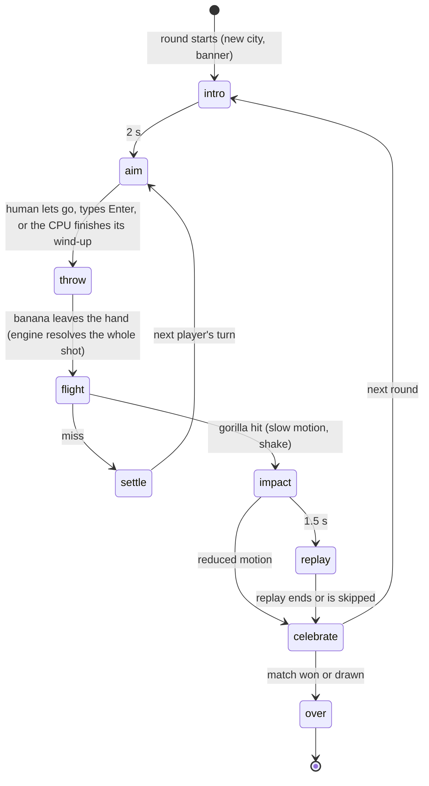
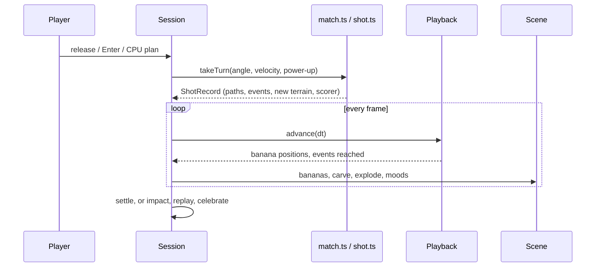
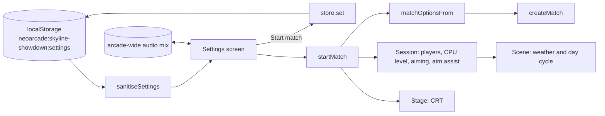

# Skyline Showdown — architecture

The game has three layers. A pure **engine** decides everything and never
touches the DOM. A **game** layer runs turns, input, the CPU and playback.
The **render** and **ui** layers make it visible and audible. Shared pieces
(`@shared/*`) handle input, audio, the loop, randomness, storage and
post-processing.

## Module overview

```mermaid
flowchart TB
  subgraph engine["engine/ (pure, seeded, tested)"]
    constants[constants.ts]
    worlds[worlds.ts]
    skyline[skyline.ts]
    wind[wind.ts]
    gorillas[gorillas.ts]
    terrain[terrain.ts]
    powerups[powerups.ts]
    shot[shot.ts]
    match[match.ts]
    ai[ai.ts]
  end
  subgraph game["game/"]
    session[session.ts]
    playback[playback.ts]
    aim[aim.ts]
    typed[typed-entry.ts]
    controls[controls.ts]
    title[title-show.ts]
  end
  subgraph render["render/"]
    stage[stage.ts]
    camera[camera.ts]
    scene[scene.ts]
    city[city.ts]
    backdrop[backdrop.ts]
    atmosphere[atmosphere.ts]
    skybody[sky-body.ts]
    gorilla[gorilla.ts]
    effects[effects.ts]
    palette[palette.ts]
  end
  subgraph ui["ui/"]
    hud[hud.ts]
    screens["title / settings / overlays"]
    menunav[menu-nav.ts]
  end
  main[main.ts] --> session
  main --> title
  main --> screens
  main --> stage
  settings[settings.ts] --> match
  match --> skyline
  match --> wind
  match --> gorillas
  match --> shot
  match --> powerups
  shot --> terrain
  session --> match
  session --> ai
  session --> playback
  session --> aim
  session --> typed
  session --> controls
  session --> scene
  session --> hud
  stage --> camera
  stage --> fx["@shared/fx"]
  scene --> city
  scene --> backdrop
  scene --> atmosphere
  scene --> skybody
  scene --> gorilla
  scene --> effects
  scene --> palette
  controls --> input["@shared/input"]
  main --> loop["@shared/loop"]
  session --> audio["@shared/audio"]
```



## Folder tree

```
ports/skyline-showdown/
├── index.html              page shell; the game mounts into #game
├── favicon.svg             code-drawn icon
├── playwright.config.ts    browser tests for this port (smoke, screens, playtest)
├── README.md
├── docs/                   ABOUT, HOW-TO-PLAY, this file
├── media/                  screenshots used by the docs and the Hall
├── e2e/
│   ├── helpers.ts          fake-clock stepping, mirrored matches, throw search
│   ├── game.spec.ts        smoke: title, keyboard throw vs CPU, pause, typed win, balloon, settings
│   ├── art.screens.ts      screenshots of every state, world and viewport
│   └── cpu.playtest.ts     full matches against every CPU level, checked against the rules
├── test/fixtures.ts        hand-built cities for engine tests
└── src/
    ├── main.ts             wiring: stage, audio, controls, screens, loop
    ├── settings.ts         settings, presets, validation, match options
    ├── styles.css          HUD and menus
    ├── engine/
    │   ├── constants.ts    world size, step time, radii, the sun
    │   ├── worlds.ts       gravity and wind scale per world
    │   ├── skyline.ts      the city: four slope patterns, windows
    │   ├── wind.ts         the original's wind roll
    │   ├── gorillas.ts     placement, hitboxes, throwing hand
    │   ├── terrain.ts      buildings minus craters and cuts; collision
    │   ├── powerups.ts     kinds, balloons and their drift
    │   ├── shot.ts         the throw simulation: segments, collisions, events
    │   ├── match.ts        rounds, turns, scoring, power-up inventory
    │   └── ai.ts           the CPU opponent
    ├── game/
    │   ├── session.ts      one match: phases, humans, CPU, reactions, replay
    │   ├── playback.ts     plays a finished shot back in time
    │   ├── aim.ts          slingshot and keyboard aiming
    │   ├── typed-entry.ts  Classic "Angle: / Velocity:" input
    │   ├── aim-guide.ts    the hidden practice guide against the CPU
    │   ├── controls.ts     key, pointer and pad bindings
    │   └── title-show.ts   the title screen's establishing shot
    ├── render/
    │   ├── stage.ts        canvas, resize, post-processing
    │   ├── camera.ts       fit, follow, push-in, shake
    │   ├── scene.ts        one round's visuals in draw order
    │   ├── city.ts         offscreen facades, windows, rooftops, carving
    │   ├── backdrop.ts     sky, stars, parallax skylines, street
    │   ├── atmosphere.ts   clouds, smoke, flags, rain, fog, lightning
    │   ├── sky-body.ts     the mascot: Sun, Earth, Phobos, Io
    │   ├── gorilla.ts      vector gorillas, moods, the banana shape
    │   ├── effects.ts      fire, sparks, debris, smoke, embers, falling roofs
    │   └── palette.ts      colours per world and time of day
    ├── ui/
    │   ├── hud.ts          name plates, wind, aim readout, typed panel, toasts
    │   ├── title-screen.ts
    │   ├── settings-screen.ts
    │   ├── overlays.ts     pause, victory, rotate hint
    │   ├── menu-nav.ts     gamepad and arrow keys in menus
    │   ├── dom.ts, icons.ts
    └── audio/sounds.ts     every sound patch and song
```

## The loop and the state machine

`main.ts` runs `@shared/loop` at a fixed 60 steps a second. Each step
updates the menus and either the title show or the current `Session`. Each
display frame renders the stage once. The session is a small state machine.



The whole throw is simulated the moment the banana leaves the hand
(`takeTurn` → `simulateShot`). The `ShotRecord` holds every banana's path
and every event, each stamped with its step. `ShotPlayback` then walks that
record at `STEPS_PER_SECOND`, smoothing between steps, and hands events to
`Session.react()`, which triggers effects, sounds, carving and reactions.
Nothing on screen can change the outcome.



## Engine rules and formulas

- **World:** 640 × 350 units, y down, street at y = 335 (`constants.ts`).
- **Throw:** degrees measured from the thrower's side, mirrored for player 2
  (`worldAngle`). Velocity is rounded to a whole number, both clamped to
  0–360.
- **Flight:** each banana is a chain of ballistic segments. Within a
  segment, `x = x₀ + vx·τ + ½·(wind/5)·τ²` and `y = y₀ + vy·τ + ½·g·τ²`,
  where τ = (step − segment start) × 0.1. A bounce or a split starts a new
  segment from the current position and velocity.
- **Checks per step:** off the sides (x ≤ 6 or x ≥ 634) or into the street
  (y ≥ 339) ends the throw as a miss. Above the top edge nothing is
  checked. Otherwise the path is walked in 2-unit hops, checking in order:
  sun (pass through, once), balloon (pass through, collect), each gorilla's
  three hitboxes, then terrain.
- **Terrain:** solid = inside a building rectangle and outside every crater
  and cut (ADR 0003).
- **Explosion:** crater radius 7, or 14 for a Golden Banana. A golden blast
  that reaches the roof removes the roof section above it (±1.6 × radius
  wide), and hits any gorilla standing there or inside the blast.
- **Gorilla hit:** a 16-unit crater at its centre; the thrower scores, or
  the opponent does on a self-hit.
- **Fumble:** velocity below 2 drops the banana onto the thrower.
- **Balloon:** drifts `wind × 0.06` units per step (±0.12 when calm), only
  while a banana is in the air. A 30 % chance per turn when none is out.
- **Match:** `firstTo` ends at N; `total` ends when the scores add up to N,
  and a draw is possible. Turns alternate forever. Each round draws from its
  own seeded generator, so a city never depends on earlier throws.

## Rendering pipeline

1. `Stage` owns a Canvas 2D *scene canvas* at device resolution, and a
   `@shared/fx` post-process (bloom, vignette, per-palette colour grading,
   optional CRT) whose output canvas is what is on screen.
2. `Camera` maps the world so it fits the screen with the street at the
   bottom, adding follow, push-in and shake.
3. `Scene.draw` paints back to front: sky gradient and stars → sky body →
   lightning → far skyline (parallax ×0.6) → clouds → middle skyline
   (×0.3) → fog → **the city canvas** → embers → rooftop life → street →
   ghost trail → balloon → gorillas → turn marker → aim line → bananas and
   trails → effects → rain.
4. Static layers (city, both skylines, cloud sprites) are painted once per
   round and resolution into offscreen canvases. Per frame they cost one
   `drawImage` each.

## Where every visual "asset" lives

| What | Code |
|---|---|
| Sky gradients, horizon glow, stars, Jupiter's bands and Red Spot | `render/backdrop.ts` (`drawSky`, `drawCloudBands`) |
| Distant skylines (towers, spires, domes, stepped tops) | `render/backdrop.ts` (`paintSkyline`, `paintSilhouette`) |
| Street and lamps | `render/backdrop.ts` (`drawStreet`) |
| Playable buildings: facade styles, windows, neon signs, water towers, AC units | `render/city.ts` |
| Crater scorch and holes, knocked-off roofs | `render/city.ts` (`carveCrater`, `knockOff`) |
| Clouds, chimney smoke, flags, antenna lights, rain, fog, lightning | `render/atmosphere.ts` |
| The Sun, Earth, Phobos, Io and their faces | `render/sky-body.ts` |
| Gorillas: skeleton, moods, faces, bandanas, shield | `render/gorilla.ts` |
| The banana | `render/gorilla.ts` (`drawBananaShape`), trails in `render/scene.ts` |
| Balloons and crates | `render/scene.ts` (`drawBalloon`, `POWER_UP_COLOURS`) |
| Fire, sparks, debris, smoke, fur, flashes, rings, embers | `render/effects.ts` |
| Palettes for 4 worlds × dusk, night and dawn | `render/palette.ts` |
| Post-processing (bloom, vignette, grading, CRT) | `@shared/fx`, set up in `render/stage.ts` |
| HUD, menus, icons | `ui/*.ts`, `styles.css`, `ui/icons.ts` |
| Sound effects, the theme, city hum, victory jingle | `audio/sounds.ts` (synth patches for `@shared/audio`) |
| Title and logo | `ui/title-screen.ts` + `styles.css` (neon text in Tilt Neon) |

## How settings flow



Sound levels live in the arcade-wide `@shared/audio` mix, so mute and
volume carry across every NeoArcade game.

## Tests

| Layer | Where | What |
|---|---|---|
| Engine | `src/engine/*.test.ts` | Four slope patterns and their shapes, widths, heights, windows; the wind distribution; placement; the closed-form path; determinism; mirroring; leaving the field; collision order; carving; the sun; balloons; fumbles; tunnelling; every power-up; turns, scoring and both match formats; CPU convergence at each level |
| Game helpers | `src/game/*.test.ts`, `src/settings.test.ts` | Playback timing and events; slingshot and keyboard aiming; typed input; presets and validation |
| Browser | `e2e/game.spec.ts` | Real flows against the production build, on a stepped fake clock |
| Screenshots | `e2e/art.screens.ts` | Every state, world and viewport, reached by actually playing |
| Playtest | `e2e/cpu.playtest.ts` | Full matches against each CPU level, with Node replaying the same match to check the score after every throw |

Run them with `npm test`, then
`npx playwright test -c ports/skyline-showdown --project=smoke`
(or `screens`, or `playtest`).

## How to extend

- **Add a power-up.** Add a kind and its text in `engine/powerups.ts` and
  its effect in `engine/shot.ts` (a flag on the flight, or a new branch in
  `touch()` / `explode()`). Give it a colour in `render/scene.ts`, an icon in
  `ui/icons.ts`, and a line in HOW-TO-PLAY. Add an engine test. Settings
  pick it up automatically.
- **Add a world.** Add it to `WORLDS` in `engine/worlds.ts` (gravity and wind
  scale), three palettes in `render/palette.ts`, a sky body in
  `render/sky-body.ts`, and weather rules in `rollWeather`. The settings
  screen lists worlds automatically.
- **Tweak the CPU.** Change the numbers in `CPU_LEVELS` (`engine/ai.ts`),
  then run `npm test`: `ai.test.ts` checks the levels stay in order and
  within their targets. The playtest shows how matches feel.
- **Change the look.** Colours live in `render/palette.ts`. Facade styles
  are in `City.paintTexture`, and rooftop scenery in `planRooftops` and
  `paintRooftopProps`.
- **Aim assist and the hidden aim guide.** Both come from `AimGuide`
  (`game/aim-guide.ts`), which asks `previewTurn` in `engine/match.ts`: the
  same simulation as `takeTurn`, without changing the match. The session
  hands the scene a `ThrowPreview`; `Scene.drawGuide` draws the first third
  of the flight (`ASSIST_SHARE`) for the **Aim assist** setting, or the
  whole path with its landing and a crosshair on a hit for the hidden guide
  (C while aiming against the CPU, left out of the menus and the player's
  guide on purpose). Only people get either; the CPU never simulates a
  throw. To change how much the assist shows, change `ASSIST_SHARE`.
- **New sounds or music.** Add patches or a `Song` to `audio/sounds.ts` and
  play them from the session.
