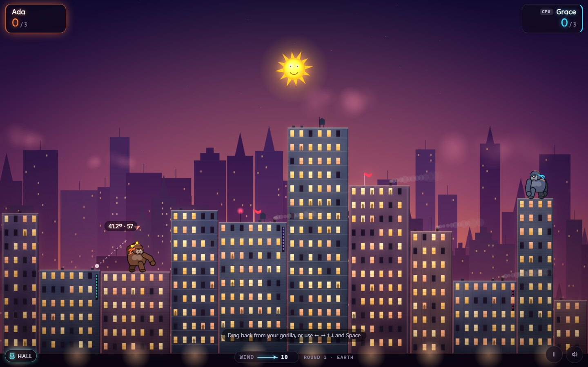
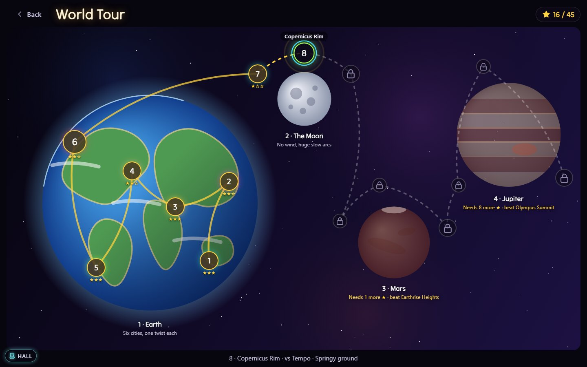
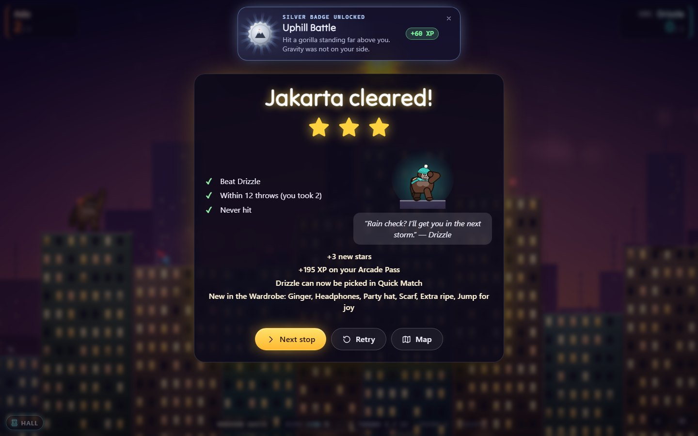
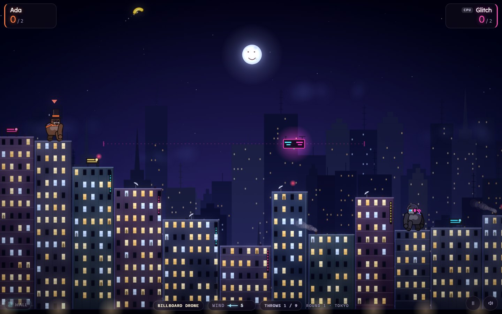
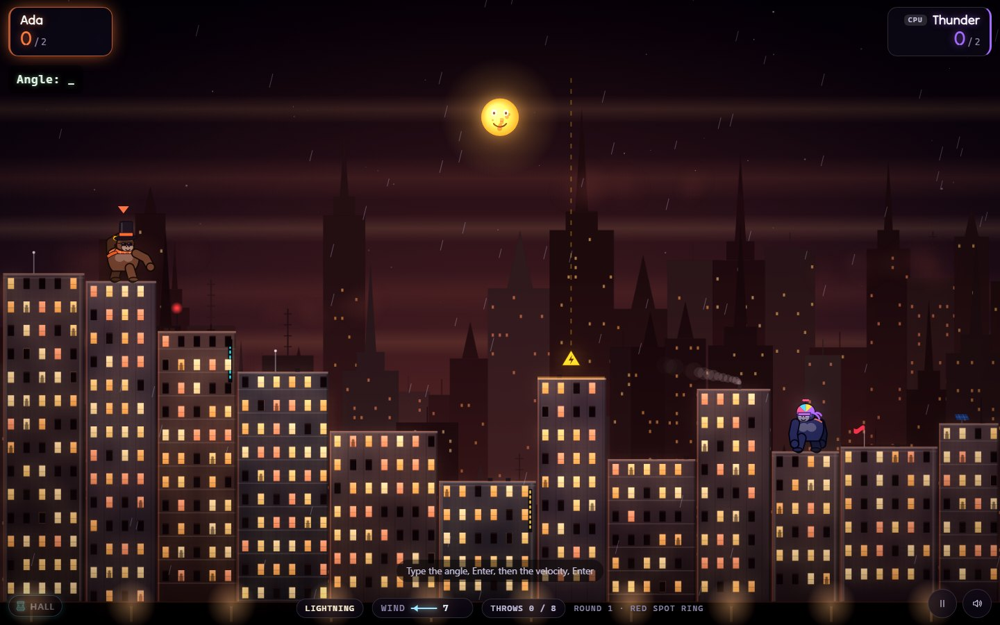
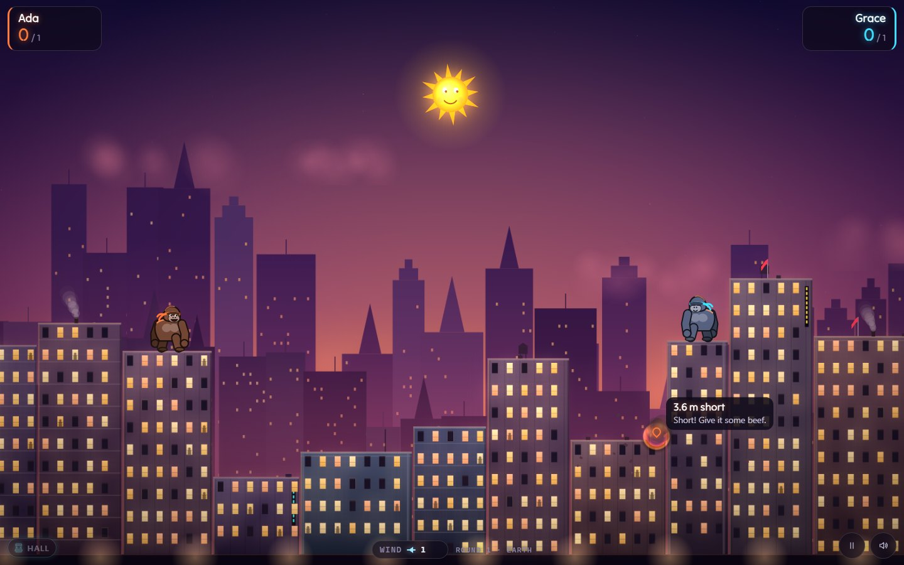
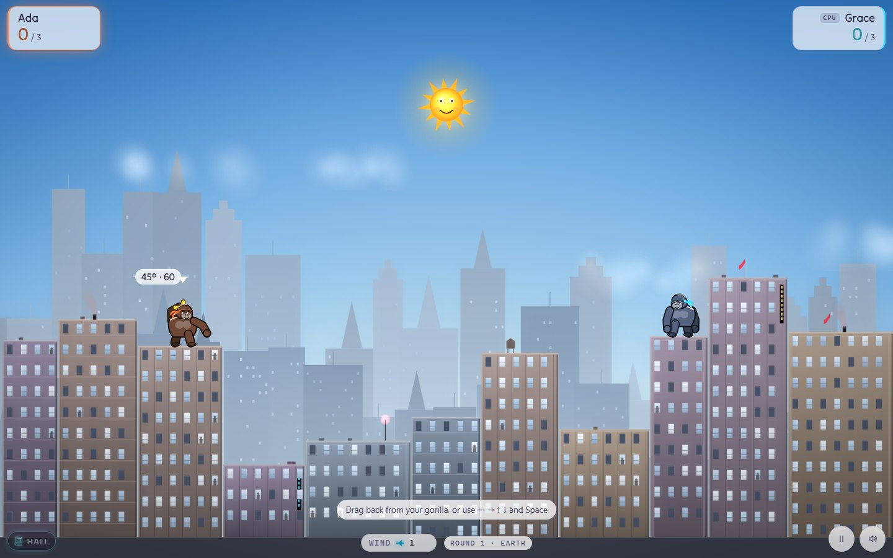
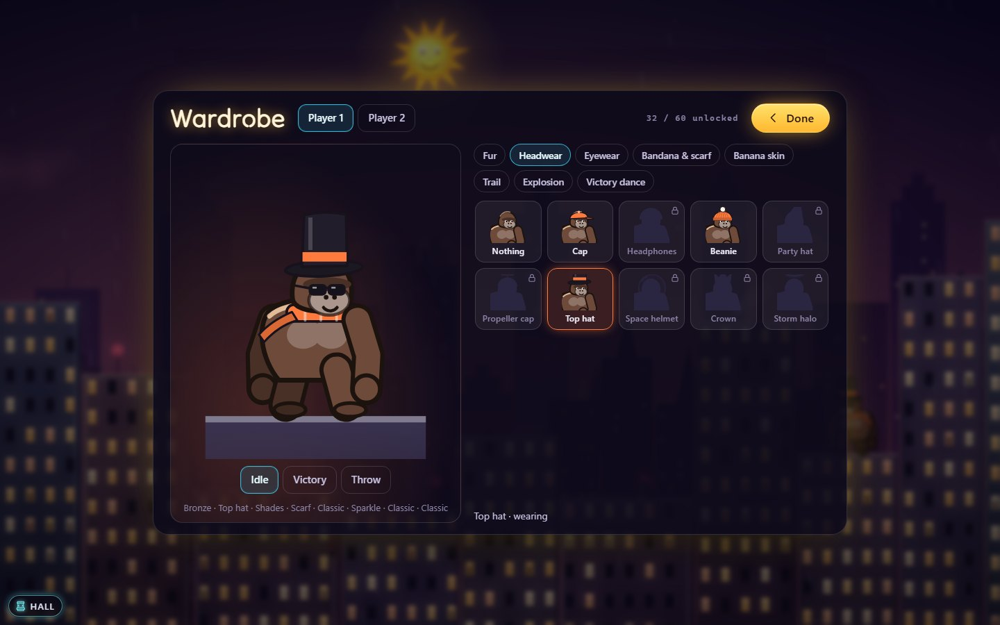
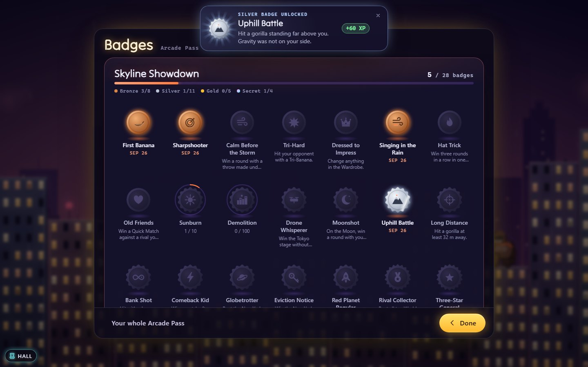

# How to play Skyline Showdown

## The goal

Two gorillas stand on rooftops at opposite ends of a city. Take turns
throwing exploding bananas at each other. Pick an angle and a power, allow
for the wind and gravity, and clear the skyline in between. Hit the other
gorilla to score. Hit yourself and the point goes to your opponent.

Play the **World Tour** on your own, from Jakarta to the eye of Jupiter's
storm, or a **Quick Match** against a friend or the CPU.

## Controls

| Action | Keyboard | Mouse / touch | Gamepad |
|---|---|---|---|
| Aim (slingshot) | — | Press on your gorilla, drag back, release | — |
| Swing the aim left / right | <kbd>←</kbd> <kbd>→</kbd> (or <kbd>A</kbd> <kbd>D</kbd>) | — | Left stick or d-pad left / right |
| More / less power | <kbd>↑</kbd> <kbd>↓</kbd> (or <kbd>W</kbd> <kbd>S</kbd>) | — | Left stick or d-pad up / down, triggers |
| Fine steps | Hold <kbd>Shift</kbd> | — | Hold LB |
| Throw | <kbd>Space</kbd> or <kbd>Enter</kbd> | Let go of the drag | A |
| Use your power-up (Quick Match) | <kbd>U</kbd> | Tap it on your name plate | Y |
| Type a throw (Classic aiming) | Digits, <kbd>.</kbd>, <kbd>Backspace</kbd>, <kbd>Enter</kbd> | On-screen number pad | — |
| Skip the instant replay | <kbd>Space</kbd> | Tap the replay banner or the screen | A |
| Pause | <kbd>Esc</kbd> or <kbd>P</kbd> | Pause button, bottom right | Start |
| Mute | <kbd>M</kbd> | Speaker button, bottom right | — |
| Menus, the map, the wardrobe | <kbd>Tab</kbd>, <kbd>↑</kbd> <kbd>↓</kbd>, <kbd>Enter</kbd>, <kbd>Esc</kbd> | Tap | D-pad, A, B |

"Left" and "right" always swing the throwing arm the way the arrow points,
whichever way your gorilla faces.

## Your first game

1. From the Arcade Hall, press **Play** on the Skyline Showdown cabinet,
   then **World Tour** on the title screen.
2. The map opens on Earth, with **Jakarta** glowing. Choose it. The stage
   card introduces your rival, Drizzle, explains the twist in one sentence
   with a little moving diagram, and lists the three stars on offer. Press
   **Play**.
3. Read the **wind gauge** at the bottom of the screen. The arrow points
   where the wind blows and the number says how hard. Chimney smoke, flags
   and rain lean the same way. In Jakarta the monsoon changes it after
   every throw, so look again each turn.
4. Press on your gorilla and drag back and down, like pulling a slingshot.
   The number beside the arm shows the angle and the power. Let go to throw.
5. Watch where the banana lands. A pin marks the spot and tells you how
   close it came: "3.2 m short". A faint dotted trail of that throw stays on
   screen during your next turn, so you can adjust from it.
6. Throw again, a little longer or shorter, until Drizzle goes up in smoke.
   That is one point, the replay, and a new city for the next round. Two
   points win the stage.
7. The results show your stars. **Next stop** takes you to Tokyo.

## The main menu

| | |
|---|---|
| **World Tour** | The campaign. The button shows your stars so far. |
| **Quick Match** | One match, your rules: a friend on the same device, the CPU, or a rival you've beaten. |
| **Wardrobe** | Dress player 1's and player 2's gorillas. |
| **Badges** | This game's shelf of your Arcade Pass. |
| **Settings** | Aiming, aim assist, names, theme, CRT filter, sound. |
| **How to play** | This guide. |
| **Back to Hall** | The Arcade Hall. |

## The World Tour

Fifteen stops in four chapters. Each chapter is its own world with its own
gravity: Earth first, then the Moon, Mars and Jupiter. Stages are short,
**first to 2 points**; the last stop of every chapter is a **boss, first
to 3**. There are no balloons or power-ups on the tour: every stage is about
its twist.

### Stars

Every stage offers three stars:

1. ★ **Win** the stage.
2. ★ **Win within the throw budget**: that many of your own throws or
   fewer, over the whole match. The HUD counts them for you ("Throws 4 / 9").
3. ★ **Win without being hit.** A self-hit counts as being hit.

Stars are counted, not tied to one goal: a win that meets the budget but
takes a hit is two stars. Your best result on each stage is kept, and you
can replay any stage you've reached to improve it.

**Aim assist** is allowed on the tour, but a stage played with it can earn
**one star at most**. The stage card tells you when it's on.

### Chapters and how they open

Stops open one after another. A new chapter opens when you've beaten the
previous chapter's boss **and** collected enough stars in total:

| Chapter | World | Stops | Opens with | Feel |
|---|---|---|---|---|
| 1 · Earth | Earth, 9.8 m/s² | 6 | — | Learn the game, one twist per city |
| 2 · The Moon | Moon, 1.62 m/s² | 3 | 10 ★ and New York beaten | No wind, huge slow arcs |
| 3 · Mars | Mars, 3.71 m/s² | 3 | 17 ★ and Earthrise Heights beaten | Thin air and dust |
| 4 · Jupiter | Jupiter, 24.79 m/s² | 3 | 24 ★ and Olympus Summit beaten | Crushing gravity, storms |

There are 45 stars in all. A good player moves quickly; anyone can get
there by coming back for a few more stars.

### Every stop, its twist, and how to beat it

| # | Stop | Rival | Twist | Throw budget | Tips |
|---|---|---|---|---|---|
| 1 | **Jakarta** | Drizzle | *Monsoon gusts*: the wind shifts a few notches after every throw. | 12 | Look at the gauge before every throw. Keep your angle and change the power by how much the wind changed. |
| 2 | **Tokyo** | Glitch | *Billboard drone*: a drone patrols a line between you and stops any banana it touches. It only moves while a banana flies. | 9 | Its whole patrol line is drawn. Lob over it, or time a flat throw to pass while it's at the far end. |
| 3 | **Dubai** | Summit | *Supertall and jet stream*: a tower in the middle, and a band high up with its own, stronger wind (written in the band). | 11 | A high lob clears the tower but meets the jet stream: allow for *its* wind, not the ground's. Or blast a hole through the tower and go flat. |
| 4 | **Cairo** | Mirage | *Heat haze*: the wind gauge is hidden. | 10 | Flags stream away from the wind; smoke leans with it; clouds drift with it. Your first miss tells you the rest. |
| 5 | **Rio** | Tempo | *Hillside city*: the city climbs a steep hill, so one gorilla is far above the other. | 8 | Throwing uphill needs more power than it looks; downhill, much less. Tempo overcorrects: stay calm and let it. |
| 6 | **New York** (boss) | The Landlord | *Rush hour*: the drone and the gusts together. First to 3. | 18 | The Landlord starts sharp but gets rattled when hit. Land the first one. |
| 7 | **Tranquility Flats** | Drizzle | *No air at all*: no wind, a sixth of Earth's gravity. | 9 | Throw far softer than you think. Tiny changes in power go a long way; use Shift for fine steps. |
| 8 | **Copernicus Rim** | Tempo | *Springy ground*: every banana bounces once off the first building it hits. | 7 | Bank shots: land short on a roof and let the bounce carry it. |
| 9 | **Earthrise Heights** (boss) | Orbit | *Low orbit*: springy ground and a patrol drone. First to 3. | 13 | Long flights mean the drone travels further during your throw: watch where it will be. |
| 10 | **Dust Basin** | Glitch | *Dust devil*: a whirling column shoves bananas sideways as they pass, then wanders between throws. | 8 | Arrows inside the column show its push. Go over it, or allow for it. |
| 11 | **Red Canyon** | Mirage | *Dust storm*: a canyon slope, and the wind gauge hidden. | 8 | Read the dust and the flags; mind the height difference. |
| 12 | **Olympus Summit** (boss) | Rust | *Summit storm*: the city climbs a mountain slope, and a dust devil prowls between you. First to 3. | 11 | Rust throws flat and fast and overshoots. Mind the height difference, and go over the devil rather than through it. |
| 13 | **Storm Harbor** | Summit | *Jovian storms*: crushing gravity, and gusts after every throw. | 9 | Throw hard and fairly flat; on Jupiter every gust is bigger. |
| 14 | **Red Spot Ring** | Thunder | *Lightning*: a warning sign marks a rooftop one throw ahead, and lightning blasts it between throws. | 8 | The city reshapes itself. A strike never hits a gorilla or the roofs next to one, but it can open a path, or close one. |
| 15 | **The Eye** (final boss) | Colossus | *Eye of the storm*: lightning, gusts and a jet stream at once. First to 3. | 15 | Colossus is Brutal and adapts fast, but its nerves crack when you land a hit. |

### Rivals

| Rival | Who they are | How they play |
|---|---|---|
| Drizzle | The cheerful rookie | Throws high, learns slowly |
| Glitch | Runs on energy drinks | Flat and fast |
| Summit | Only happy at the top | Sky-high lobs |
| Mirage | Speaks in riddles | Calm, careful, trusts instinct |
| Tempo | Never stops moving | Overcorrects wildly |
| The Landlord | Owns every roof in town | Starts sharp, rattled when hit |
| Orbit | Has all the time in the world | Patient, floaty lobs |
| Rust | Grit in every throw | Flat, fast and aggressive |
| Thunder | Feeds on storms | Reads the storm, pushes hard |
| Colossus | The storm at the end of the tour | Adapts fast; only nerves can crack it |

Rivals come back sharper later in the tour. They talk, too: a hello at the
start, a jab when you miss by a whisker, a yelp when you hit them, and a
last word at the end. Beat a rival once and you can pick them as your
opponent in **Quick Match**.

## "So close!"

After every miss, a pin marks where the banana came down, with how close it
came to the other gorilla in metres (a gorilla is about 2 m tall) and
which way it missed:

| Verdict | Meaning |
|---|---|
| **short** | It came down before the target. More power, or a lower angle. |
| **long** | It went past. Less power. |
| **over** | It sailed right over their head. |
| **blocked** | A building (or the drone) stopped a throw that was heading the right way. Lob higher, or blast through. |

Your misses get a line of encouragement too ("Just a banana's width!"),
never the same one twice in a row. The CPU's misses get just the pin and
the distance. It all fades before the next turn.

## Quick Match

Choose **Quick Match** on the title screen. Two presets set the rules at
once; changing any single setting turns them into "Custom rules". Your last
choices are remembered.

| Setting | Classic 1990 | NeoArcade | What it changes |
|---|---|---|---|
| Players | Two players | Versus CPU | Two people taking turns on one device, you against the CPU, or two CPUs to watch. |
| Opponent | – | CPU | Against the CPU: the plain CPU, or any rival you've beaten on the World Tour (they play at their own level). |
| CPU difficulty | – | Normal | Easy, Normal, Hard or Brutal (see below). Not used against a rival. |
| Names | Player 1 / Player 2 | Player 1 / Player 2 | Up to 10 characters, just like the original. |
| World | Earth | Earth | The planet sets gravity, the wind and the look (see below). |
| Match | 3 points, Total points | 3 points, First to | 1 to 20 points. *Total points* plays exactly that many points and can end in a draw; *First to* ends as soon as someone gets there. |
| Aiming | Type numbers | Slingshot + keys | Type the angle and velocity like 1990, or drag, steer with keys and pad. |
| Aim assist | Off | Off | While you aim, a dotted line shows the first third of your throw's flight, including the wind. Where it lands is still up to you. The CPU never uses it. |
| Power-ups | Off | On (all five) | Balloons carrying crates drift over the city. Each kind can be switched off. |
| Weather and day cycle | Off | On | Dusk turns to night and dawn over the rounds, with rain, fog and lightning. It only changes the look. |
| CRT filter | On | Off | Scanlines and a curved-glass look. |
| Theme | Auto | Auto | *Auto* follows your device's light or dark setting. *Light* gives menus and a bright daytime city; *Dark* keeps the city at dusk. Night rounds stay dark in either theme. A personal choice: it applies straight away, whatever the preset. |
| Sound | – | – | Separate volumes for effects and music. Mute is shared with the whole arcade. |

## Settings

**Settings** on the title screen holds the choices that follow you into
the World Tour as well as Quick Match: aiming (slingshot or typed), aim
assist, both players' names, the theme, the CRT filter, weather in Quick
Match, and sound. They apply straight away. The tour uses player 1's name,
or calls you "You" until you choose one.

## Worlds

| World | Gravity | Wind | What to expect |
|---|---|---|---|
| Earth | 9.8 | As in 1990 | The classic. |
| Moon | 1.62 | None (no air) | Slow, floaty arcs. Small changes in power go a long way. |
| Mars | 3.71 | Light (thin air) | Long, lazy throws under a dusty sky. |
| Jupiter | 24.79 | Strong | Bananas drop like stones. Throw hard and fairly flat. |
| Random (Quick Match) | – | – | A new world every round. |

## CPU difficulty

| Level | How it plays |
|---|---|
| Easy | Ignores the wind, corrects slowly and has a shaky hand. Usually needs half a dozen throws. |
| Normal | Reads some of the wind and walks its throws in within about four. |
| Hard | Good first guesses and sharp corrections. |
| Brutal | Often hits within two or three throws, but never guarantees the first. |

The CPU thinks for a moment, then visibly swings its arm to the angle and
power it chose, so you can watch it work. Rivals add a style on top: some
lob, some throw flat, some overcorrect, some get rattled.

## Scoring

- Hit the other gorilla: **you** score.
- Hit your own gorilla, for example by throwing straight up or with a power
  below 2: your **opponent** scores. (The 1990 original accidentally gave
  you the point; Skyline Showdown fixes that.)
- A banana that leaves the screen at the sides, drops into the street, hits
  a building or is caught by the drone is a miss, and the turn passes.
- A banana that flies over the top of the screen keeps going and comes back
  down.
- Every round starts on a new city with new wind. Turns keep alternating
  across rounds.

## Power-ups (Quick Match)

When power-ups are on, a balloon with a crate sometimes floats over the
city. It hovers while you aim and drifts with the wind while a banana is in
the air. Hit the balloon or the crate and the power-up is yours. The banana
keeps flying, so it can still hit something. You can hold one power-up at a
time; a new one replaces the old. Use it on a later turn, at most one per
turn: tap it on your name plate or press <kbd>U</kbd> before throwing.

| Power-up | Effect |
|---|---|
| Golden Banana | Twice the blast. If it bursts near a roof, it knocks that roof section off, and a gorilla standing on it falls with it. It always looks golden, whatever banana skin you wear. |
| Tri-Banana | Splits into three at the top of its arc. |
| Calm Air | No wind for this throw. |
| Bouncer | Bounces once off a building before exploding. |
| Rooftop Shield | A bubble that absorbs one hit on your gorilla. It lasts until it is used or the round ends. |

## The wardrobe

Player 1 and player 2 each dress their own gorilla; switch between them at
the top. The preview shows your gorilla idling, dancing, or throwing a
banana so you can see its skin, trail and explosion. Items you haven't
unlocked wait as silhouettes; choose one to see how to earn it.

| Slot | Some of what's in it |
|---|---|
| Fur | Bronze, Slate, Charcoal, Cocoa, Ginger, Rose, Silverback, Midnight, Snow, Gilded |
| Headwear | Cap, Headphones, Beanie, Party hat, Propeller cap, Top hat, Space helmet, Crown, Storm halo |
| Eyewear | Shades, Aviators, 3D glasses, Dust goggles, Monocle, Neon visor |
| Bandana & scarf | Head bandana (the classic), Scarf, Bow tie, Cape, Gold medal |
| Banana skin | Classic, Not quite ripe, Extra ripe, Pixel, Fire, Candy stripe, Glow-stick, Chrome |
| Trail | Classic streak, Hearts, Sparkle, Neon, Smoke, Rainbow, Bubbles |
| Explosion | Classic, Pixel burst, Confetti, Fireworks, Starburst, Paint splat |
| Victory dance | Classic, Jump for joy, Robot, Spin, Flex, Chest thump |

Sixty items in all. Some are free; the rest unlock with **World Tour
stars**, by **beating a rival** (Orbit's space helmet, Rust's goggles), with
**badges**, or at an **Arcade Pass level**. Nothing you wear changes how a
banana flies or where your gorilla can be hit: a hat is a hat, and a
banana through its brim is a miss.

## Badges and the Arcade Pass

Skyline Showdown reports to your **Arcade Pass**, the profile you share
across NeoArcade (it lives in this browser). You earn XP for:

| What | XP |
|---|---|
| Playing a match to the end | 10 |
| Winning a Quick Match | 30 |
| Winning a tour stage (a boss: 60) | 40 |
| Every new star | 15 |
| Beating a rival for the first time | 100 |
| Badges | 25 to 250 each |

The Pass has a daily allowance, so playing all day doesn't pay more than
playing well. There are 28 badges: bronze, silver and gold ones with a hint
to earn them, counted ones that fill up (Sunburn: hit the sun 10 times;
Demolition: carve 100 craters), and four secrets. Open **Badges** to see
this game's shelf; badges pop up at the top of the screen between rounds
and on the results, never in the middle of your aim. Only player 1 earns
Pass progress: a friend on player 2 is a guest.

## Tips and tricks

- **Change one thing at a time.** Keep the angle and adjust the power until
  you are close, then fine-tune. The ghost trail and the "So close!" pin
  help.
- **Short, then long, then split the difference.** The CPU does it and so
  should you.
- **Mind the tall building in the middle.** A higher angle clears it. So
  does blasting a hole straight through it: holes are permanent.
- **Into the wind, throw flatter.** A high lob into a strong headwind gets
  blown back, sometimes onto your own head.
- **Chasing the budget star?** Take a moment over your first throw; a good
  opener saves two or three later.
- **Chasing the no-hit star?** Land the first hit early; every throw you
  miss is a throw your rival gets.
- **Use Shift (or LB) for fine aim.** Tenths of a degree matter on the
  Moon.
- **Don't throw straight up.** Without wind, what goes up comes down on
  you.
- **Learning? Turn on Aim assist**, then switch it off when you're ready to
  chase all three stars.

## FAQ

**Is this the original QBasic Gorillas?**
No. It is a new game inspired by it: *Inspired by QBasic Gorillas, ©
Microsoft Corporation 1990.* The rules and the feel are kept; everything
you see and hear is new.

**Can I play the way it worked in 1990?**
Yes. In Quick Match choose the **Classic 1990** preset: two players, typed
angle and velocity, total points, no power-ups, and a CRT glow.

**I'm stuck on a stage.**
Replay earlier stages for stars you missed, turn on Aim assist for a while
(it caps that stage at one star, but a win still opens the next stop), and
read the tips above. Rivals also play at their own level in Quick Match if
you want to practise against them.

**Why can't I go to the Moon?**
The map says what's missing: the New York boss, or a few more stars.

**Why did lightning blow a hole in a roof?**
On Red Spot Ring and The Eye, lightning marks a roof one throw ahead (the
yellow warning sign), then strikes it between throws. It never strikes a
gorilla or the roofs right next to one.

**Where is the wind gauge?**
In Cairo and Red Canyon it's hidden: that's the twist. Flags, smoke and
clouds still show the wind.

**Does my outfit change anything?**
No. Cosmetics are only for show. Hitboxes, physics and what you can see on
screen are the same for everyone.

**Where are my stars and outfits kept?**
In this browser, apart from your Arcade Pass. Clearing site data resets
them.

**Why is there no wind on the Moon?**
The Moon has no air. On Mars the thin air carries a gentler wind, and on
Jupiter it howls.

**Can I skip the replay?**
Yes. Press Space, or tap.

**My phone shows "Turn your phone sideways".**
The city is wide, so landscape works best. You can choose **Play anyway**.

**Can I replay the same cities?**
Add `?seed=` and a number to the address, for example `?seed=1990`.
